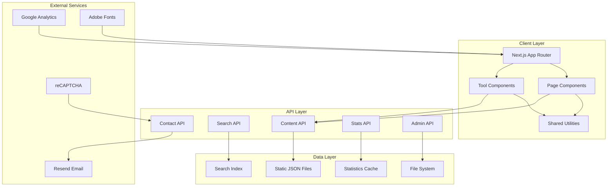
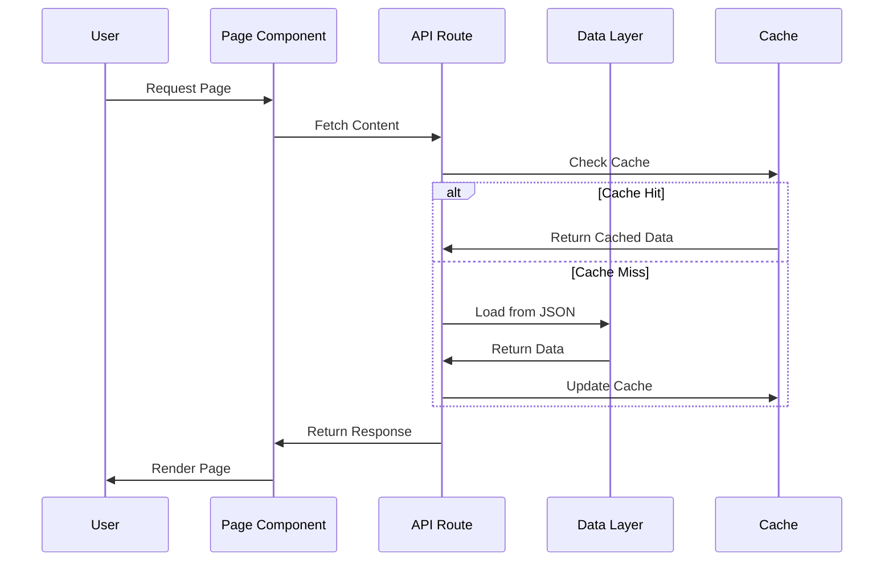
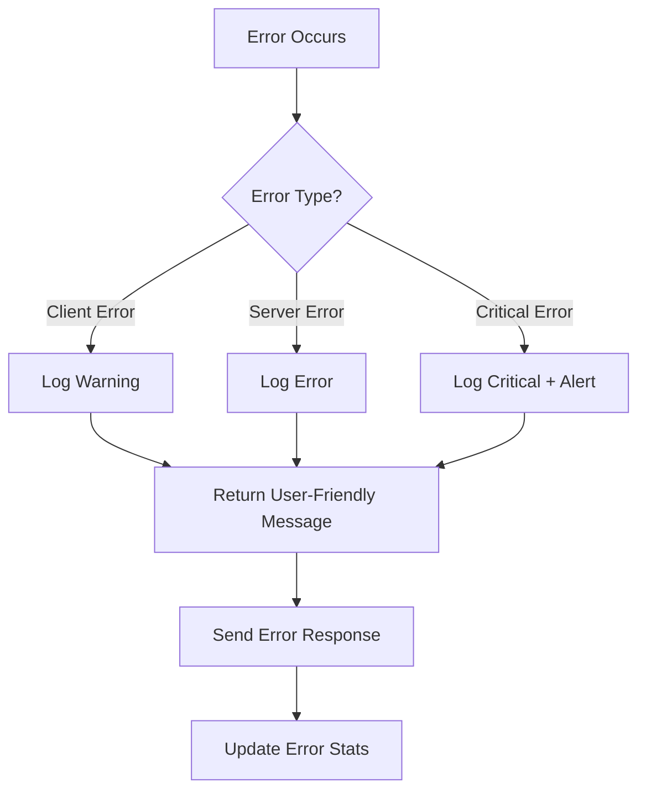
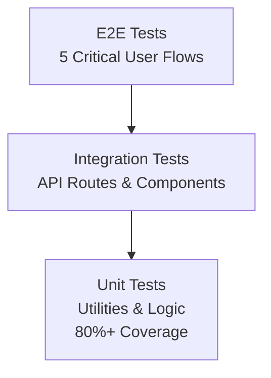
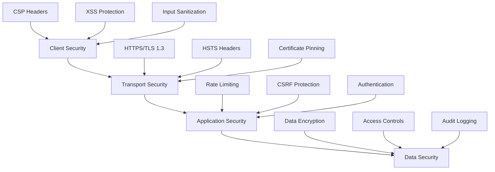
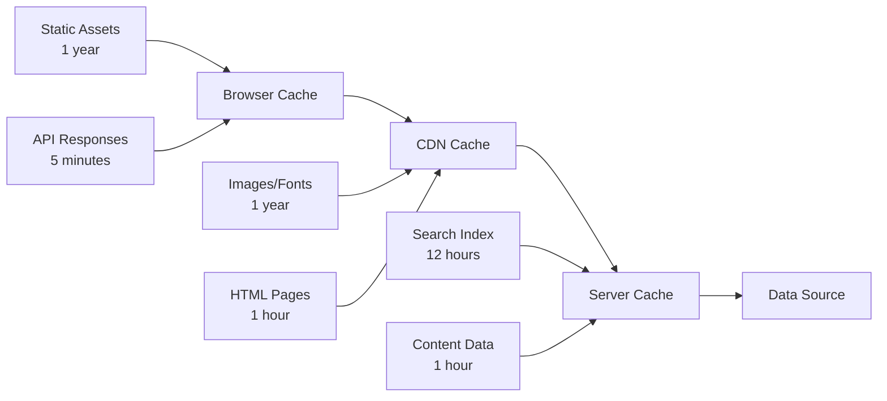

# Design Document

## Overview

The samuido portfolio website is designed as a modern, high-performance web application built with Next.js 15, featuring a unique page-based architecture where each major section operates as an independent site while sharing common data structures and utilities. The system serves multiple purposes: portfolio showcase, interactive web tools, educational content, and professional services contact.

### Key Design Principles

1. **Page-Based Independence**: Each major section (portfolio, tools, workshop, about) functions as an independent site with its own components and logic
2. **Shared Data Layer**: Common TypeScript interfaces, utilities, and API patterns ensure consistency across all sections
3. **Performance-First**: Optimized for Core Web Vitals with aggressive caching, image optimization, and code splitting
4. **Accessibility-Compliant**: WCAG 2.1 AA compliance with comprehensive keyboard navigation and screen reader support
5. **Development-Friendly**: Admin tools available only in development environment for content management

## Architecture

### High-Level System Architecture



### Page-Based Architecture Pattern

Each major section follows this pattern:

```
src/app/[section]/
├── page.tsx                 # Main page component
├── components/              # Section-specific components
│   ├── [Feature]Component.tsx
│   └── [Tool]Component.tsx
├── [subsection]/
│   └── page.tsx            # Subsection pages
└── layout.tsx              # Optional section layout
```

### Data Flow Architecture



## Components and Interfaces

### Core Data Structures

#### ContentItem Interface

The central data structure that unifies all content types across the system:

```typescript
interface ContentItem {
  // Core identification
  id: string;
  type: ContentType;
  title: string;
  description: string;

  // Organization
  category: string;
  tags: string[];
  status: 'published' | 'draft' | 'archived' | 'scheduled';
  priority: number; // 0-100 for sorting

  // Timestamps
  createdAt: string; // ISO 8601
  updatedAt?: string;
  publishedAt?: string;

  // Media and content
  thumbnail?: string;
  images?: string[];
  videos?: MediaEmbed[];
  content?: string; // Markdown or HTML
  contentPath?: string; // Path to markdown file

  // External references
  externalLinks?: ExternalLink[];
  downloadInfo?: DownloadInfo;

  // Metadata
  stats?: ContentStats;
  seo?: SEOData;
  customFields?: Record<string, unknown>;
}
```

#### API Response Pattern

All API endpoints follow this consistent response structure:

```typescript
interface APIResponse<T> {
  success: boolean;
  data?: T;
  error?: string;
  code?: string;
  pagination?: {
    limit: number;
    offset: number;
    total: number;
    hasMore: boolean;
  };
  filters?: Record<string, unknown>;
}
```

### Component Architecture

#### Page Component Pattern

Each page follows this structure:

```typescript
// src/app/[section]/page.tsx
export default function SectionPage() {
  const [data, setData] = useState<ContentItem[]>([]);
  const [loading, setLoading] = useState(false);
  const [filters, setFilters] = useState<FilterState>({});

  // Data fetching logic
  useEffect(() => {
    loadSectionData();
  }, [filters]);

  // Render section-specific UI
  return (
    <div className="section-container">
      <SectionHeader />
      <FilterControls onFilterChange={setFilters} />
      <ContentGrid items={data} loading={loading} />
    </div>
  );
}
```

#### Tool Component Pattern

Interactive tools follow this pattern:

```typescript
// src/app/tools/components/[Tool].tsx
export default function ToolComponent() {
  const [state, setState] = useState<ToolState>(initialState);
  const [results, setResults] = useState<ToolResults | null>(null);

  // Tool-specific logic
  const handleToolAction = useCallback((input: ToolInput) => {
    const result = processToolInput(input);
    setResults(result);

    // Save to localStorage if needed
    saveToolState(state);
  }, [state]);

  return (
    <div className="tool-container">
      <ToolControls onAction={handleToolAction} />
      <ToolResults results={results} />
    </div>
  );
}
```

### API Route Architecture

#### Content API Pattern

```typescript
// src/app/api/content/[type]/route.ts
export async function GET(
  request: NextRequest,
  { params }: { params: Promise<{ type: string }> }
): Promise<Response> {
  try {
    // 1. Validate content type
    const { type } = await params;
    validateContentType(type);

    // 2. Parse query parameters
    const filters = parseQueryParams(request.url);

    // 3. Load and filter data
    const items = await getContentByType(type, filters);

    // 4. Return standardized response
    return Response.json({
      success: true,
      data: items,
      pagination: calculatePagination(items, filters),
      filters,
    });
  } catch (error) {
    return handleAPIError(error);
  }
}
```

## Data Models

### Content Storage Structure

```
public/data/
├── content/
│   ├── portfolio.json      # Portfolio items
│   ├── blog.json          # Blog posts
│   ├── plugin.json        # Plugin downloads
│   ├── tool.json          # Tool configurations
│   └── profile.json       # Profile information
├── stats/
│   ├── download-stats.json # Download counters
│   ├── view-stats.json     # Page view counters
│   └── search-stats.json   # Search query stats
└── cache/
    ├── search-index.json   # Pre-built search index
    └── site-map.json       # Generated sitemap
```

### Database Schema (JSON-based)

#### Portfolio Content Example

```json
{
  "id": "portfolio-video-001",
  "type": "portfolio",
  "title": "Music Video Production",
  "description": "Complete music video production from concept to final edit",
  "category": "video",
  "tags": ["music-video", "after-effects", "premiere-pro"],
  "status": "published",
  "priority": 90,
  "createdAt": "2024-01-15T10:00:00Z",
  "publishedAt": "2024-01-20T12:00:00Z",
  "thumbnail": "/images/portfolio/video-001-thumb.webp",
  "images": ["/images/portfolio/video-001-01.webp", "/images/portfolio/video-001-02.webp"],
  "videos": [
    {
      "type": "youtube",
      "url": "https://youtube.com/watch?v=example",
      "title": "Final Music Video",
      "thumbnail": "/images/portfolio/video-001-youtube-thumb.webp",
      "duration": 240
    }
  ],
  "externalLinks": [
    {
      "type": "demo",
      "url": "https://example.com/demo",
      "title": "Live Demo"
    }
  ],
  "stats": {
    "views": 1250,
    "likes": 45
  },
  "seo": {
    "title": "Music Video Production | samuido Portfolio",
    "description": "Professional music video production showcasing creative direction and technical expertise",
    "keywords": ["music video", "video production", "after effects"]
  }
}
```

#### Tool Configuration Example

```json
{
  "id": "tool-text-counter",
  "type": "tool",
  "title": "Text Counter",
  "description": "Real-time character, word, and line counting tool with Japanese text support",
  "category": "utility",
  "tags": ["text", "counter", "japanese", "utility"],
  "status": "published",
  "priority": 80,
  "customFields": {
    "toolConfig": {
      "features": ["character-count", "word-count", "line-count", "japanese-support"],
      "maxInputLength": 10000,
      "supportedLanguages": ["en", "ja"],
      "realTimeUpdate": true
    }
  }
}
```

### Search Index Structure

```typescript
interface SearchIndex {
  id: string;
  type: ContentType;
  title: string;
  description: string;
  content: string;
  tags: string[];
  category: string;
  searchableContent: string; // Combined searchable text
  lastIndexed: string;
}
```

## Error Handling

### Error Classification System

```typescript
enum ErrorCode {
  // Client errors (4xx)
  VALIDATION_ERROR = 'VALIDATION_ERROR',
  NOT_FOUND = 'NOT_FOUND',
  UNAUTHORIZED = 'UNAUTHORIZED',
  RATE_LIMITED = 'RATE_LIMITED',

  // Server errors (5xx)
  INTERNAL_ERROR = 'INTERNAL_ERROR',
  SERVICE_UNAVAILABLE = 'SERVICE_UNAVAILABLE',
  DATA_CORRUPTION = 'DATA_CORRUPTION',

  // Content errors
  CONTENT_NOT_FOUND = 'CONTENT_NOT_FOUND',
  INVALID_CONTENT_TYPE = 'INVALID_CONTENT_TYPE',
  CONTENT_VALIDATION_FAILED = 'CONTENT_VALIDATION_FAILED',
}
```

### Error Handling Strategy



### Error Response Format

```typescript
interface ErrorResponse {
  success: false;
  error: string; // User-friendly message
  code: ErrorCode; // Machine-readable code
  details?: unknown; // Additional context (dev only)
  timestamp: string; // ISO 8601 timestamp
  requestId?: string; // For tracking
}
```

## Testing Strategy

### Testing Pyramid



### Test Categories

#### Unit Tests (Vitest)

- **Target**: 80%+ code coverage
- **Scope**: Utility functions, data processing, validation logic
- **Location**: `src/**/*.test.ts`

```typescript
// Example: lib/utils/validation.test.ts
describe('validateContactForm', () => {
  it('should validate required fields', () => {
    const result = validateContactForm({});
    expect(result.name).toBe('Name is required');
    expect(result.email).toBe('Email is required');
  });

  it('should validate email format', () => {
    const result = validateContactForm({
      name: 'Test',
      email: 'invalid-email',
      message: 'Test message',
    });
    expect(result.email).toBe('Invalid email format');
  });
});
```

#### Integration Tests (Playwright)

- **Target**: All API routes and major component interactions
- **Scope**: API endpoints, form submissions, navigation flows

```typescript
// Example: tests/api/content.spec.ts
test('Content API returns portfolio items', async ({ request }) => {
  const response = await request.get('/api/content/portfolio');
  const data = await response.json();

  expect(response.ok()).toBeTruthy();
  expect(data.success).toBe(true);
  expect(Array.isArray(data.data)).toBe(true);
});
```

#### End-to-End Tests (Playwright)

- **Target**: 5 critical user flows
- **Scope**: Complete user journeys from entry to completion

```typescript
// Example: tests/portfolio-flow.spec.ts
test('Portfolio browsing flow', async ({ page }) => {
  await page.goto('/portfolio');

  // Filter by category
  await page.click('[data-testid="filter-video"]');
  await expect(page.locator('.portfolio-item')).toHaveCount(3);

  // View portfolio detail
  await page.click('.portfolio-item:first-child');
  await expect(page.locator('h1')).toBeVisible();
});
```

### Performance Testing

#### Lighthouse CI Integration

```yaml
# .github/workflows/lighthouse.yml
- name: Run Lighthouse CI
  run: |
    npm install -g @lhci/cli
    lhci autorun
```

#### Performance Budgets

```json
{
  "budgets": [
    {
      "path": "/**",
      "timings": [
        { "metric": "first-contentful-paint", "budget": 2000 },
        { "metric": "largest-contentful-paint", "budget": 2500 },
        { "metric": "cumulative-layout-shift", "budget": 0.1 }
      ],
      "resourceSizes": [
        { "resourceType": "script", "budget": 1000 },
        { "resourceType": "image", "budget": 500 }
      ]
    }
  ]
}
```

## Security Architecture

### Security Layers



### Content Security Policy

```typescript
const cspDirectives = {
  'default-src': ["'self'"],
  'script-src': [
    "'self'",
    "'unsafe-inline'", // Required for Adobe Fonts
    'https://www.googletagmanager.com',
    'https://www.google-analytics.com',
    'https://use.typekit.net',
  ],
  'style-src': [
    "'self'",
    "'unsafe-inline'", // Required for dynamic styles
    'https://fonts.googleapis.com',
    'https://use.typekit.net',
  ],
  'font-src': ["'self'", 'https://fonts.gstatic.com', 'https://use.typekit.net'],
  'img-src': ["'self'", 'data:', 'https:', 'blob:'],
  'connect-src': ["'self'", 'https://www.google-analytics.com'],
  'frame-src': [
    'https://www.google.com', // reCAPTCHA
    'https://www.youtube.com',
    'https://player.vimeo.com',
  ],
};
```

### Rate Limiting Strategy

```typescript
interface RateLimitConfig {
  windowMs: number;
  maxRequests: number;
  skipSuccessfulRequests?: boolean;
  skipFailedRequests?: boolean;
}

const rateLimits: Record<string, RateLimitConfig> = {
  '/api/content/*': {
    windowMs: 60 * 1000, // 1 minute
    maxRequests: 60,
  },
  '/api/contact': {
    windowMs: 15 * 60 * 1000, // 15 minutes
    maxRequests: 3,
  },
  '/api/stats/*': {
    windowMs: 60 * 1000, // 1 minute
    maxRequests: 100,
  },
};
```

## Performance Optimization

### Caching Strategy



### Image Optimization Pipeline

```typescript
interface ImageOptimizationConfig {
  formats: ['webp', 'avif', 'png', 'jpg'];
  sizes: [320, 640, 960, 1280, 1920];
  quality: {
    webp: 85;
    avif: 80;
    jpg: 85;
    png: 100;
  };
  lazy: true;
  placeholder: 'blur';
}
```

### Code Splitting Strategy

```typescript
// Dynamic imports for heavy components
const LazyComponents = {
  ColorPalette: lazy(() => import('@/app/tools/components/ColorPalette')),
  ThreeJSPlayground: lazy(() => import('@/app/portfolio/components/ThreeJSPlayground')),
  VideoPlayer: lazy(() => import('@/components/VideoPlayer')),
  SequentialPngPreview: lazy(() => import('@/app/tools/components/SequentialPngPreview')),
};

// Route-based code splitting (automatic with App Router)
// Each page.tsx creates its own bundle
```

### Performance Monitoring

```typescript
interface PerformanceMetrics {
  // Core Web Vitals
  lcp: number; // Largest Contentful Paint
  fid: number; // First Input Delay
  cls: number; // Cumulative Layout Shift

  // Custom metrics
  ttfb: number; // Time to First Byte
  fcp: number; // First Contentful Paint

  // Tool-specific metrics
  toolLoadTime: number;
  searchResponseTime: number;
  contentLoadTime: number;
}
```

This design document provides a comprehensive blueprint for implementing the samuido portfolio website according to the specified requirements. The architecture emphasizes performance, maintainability, and user experience while providing the flexibility needed for the diverse content types and interactive tools.
