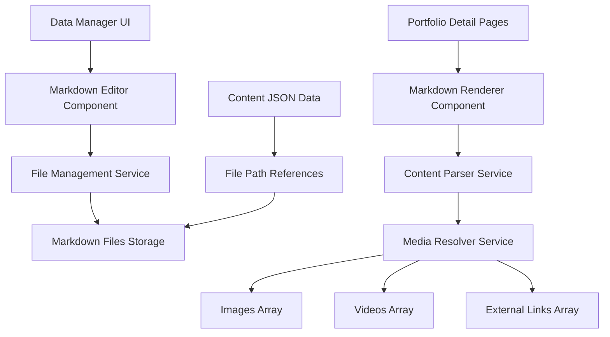

# Design Document

## Overview

このシステムは、現在のポートフォリオコンテンツデータの詳細部分（content フィールド）をMarkdown形式で外部ファイル化し、埋め込みコンテンツをサポートする機能を提供します。データマネージャーでMarkdownファイルを作成・編集し、詳細ページで自動的にレンダリングする仕組みを構築します。

## Architecture

### システム構成図



### データフロー

1. **作成・編集フロー**
   - データマネージャーでMarkdownエディターを使用してコンテンツを作成
   - ファイル管理サービスが適切なディレクトリにMarkdownファイルを保存
   - JSONデータにはファイルパスのみを格納

2. **表示フロー**
   - 詳細ページがJSONからファイルパスを取得
   - Markdownレンダラーがファイルを読み込み
   - コンテンツパーサーが埋め込み参照を解決
   - メディアリゾルバーが実際のメディアURLに変換

## Components and Interfaces

### 1. Markdown Editor Component

```typescript
interface MarkdownEditorProps {
  content: string;
  onChange: (content: string) => void;
  onSave: (filePath: string) => Promise<void>;
  preview?: boolean;
  toolbar?: boolean;
  embedSupport?: boolean;
}

interface EmbedSyntax {
  image: "![image:index]" | '![image:index "alt text"]';
  video: "![video:index]" | '![video:index "title"]';
  link: "[link:index]" | '[link:index "custom text"]';
  iframe: '<iframe src="url" title="title"></iframe>';
}
```

### 2. File Management Service

```typescript
interface FileManagementService {
  createMarkdownFile(contentId: string, content: string): Promise<string>;
  updateMarkdownFile(filePath: string, content: string): Promise<void>;
  deleteMarkdownFile(filePath: string): Promise<void>;
  getMarkdownContent(filePath: string): Promise<string>;
  generateFilePath(contentId: string): string;
}

interface MarkdownFileStructure {
  basePath: "public/data/content/markdown/";
  structure: {
    portfolio: "portfolio/{id}.md";
    download: "download/{id}.md";
    other: "other/{id}.md";
  };
}
```

### 3. Content Parser Service

```typescript
interface ContentParserService {
  parseMarkdown(content: string, mediaData: MediaData): Promise<string>;
  resolveEmbedReferences(content: string, mediaData: MediaData): string;
  validateEmbedSyntax(content: string): ValidationResult[];
}

interface MediaData {
  images: string[];
  videos: MediaEmbed[];
  externalLinks: ExternalLink[];
}

interface EmbedReference {
  type: "image" | "video" | "link";
  index: number;
  altText?: string;
  customText?: string;
}
```

### 4. Markdown Renderer Component

```typescript
interface MarkdownRendererProps {
  filePath: string;
  mediaData: MediaData;
  className?: string;
  onError?: (error: Error) => void;
}

interface MarkdownRendererState {
  content: string;
  isLoading: boolean;
  error: Error | null;
  parsedContent: string;
}
```

## Data Models

### 1. Enhanced Content Item

```typescript
interface EnhancedContentItem extends ContentItem {
  // 既存のcontentフィールドを段階的に置き換え
  content?: string; // 後方互換性のため残す
  markdownPath?: string; // 新しいMarkdownファイルパス
  markdownMigrated?: boolean; // 移行完了フラグ
}
```

### 2. Markdown File Metadata

```typescript
interface MarkdownFileMetadata {
  id: string;
  filePath: string;
  createdAt: string;
  updatedAt: string;
  size: number;
  checksum: string; // ファイル整合性チェック用
}
```

### 3. Embed Resolution Map

```typescript
interface EmbedResolutionMap {
  images: Map<number, string>; // index -> URL
  videos: Map<number, MediaEmbed>; // index -> video data
  links: Map<number, ExternalLink>; // index -> link data
}
```

## Error Handling

### 1. ファイル操作エラー

```typescript
enum MarkdownFileError {
  FILE_NOT_FOUND = "MARKDOWN_FILE_NOT_FOUND",
  PERMISSION_DENIED = "MARKDOWN_PERMISSION_DENIED",
  DISK_FULL = "MARKDOWN_DISK_FULL",
  INVALID_PATH = "MARKDOWN_INVALID_PATH",
}

interface ErrorHandlingStrategy {
  fileNotFound: () => string; // フォールバック表示
  permissionDenied: () => void; // 管理者通知
  diskFull: () => void; // システム警告
  invalidPath: () => void; // パス修正
}
```

### 2. 埋め込み参照エラー

```typescript
interface EmbedError {
  type: "INVALID_INDEX" | "MISSING_MEDIA" | "MALFORMED_SYNTAX";
  line: number;
  column: number;
  message: string;
  suggestion?: string;
}

interface EmbedErrorHandler {
  invalidIndex: (index: number, maxIndex: number) => string;
  missingMedia: (type: string, index: number) => string;
  malformedSyntax: (syntax: string) => string;
}
```

## Testing Strategy

### 1. Unit Tests

```typescript
describe("MarkdownEditor", () => {
  test("should create markdown file on save");
  test("should update existing markdown file");
  test("should validate embed syntax");
  test("should show preview with resolved embeds");
});

describe("ContentParser", () => {
  test("should resolve image references correctly");
  test("should resolve video references correctly");
  test("should resolve link references correctly");
  test("should handle invalid references gracefully");
  test("should preserve iframe embeds");
});

describe("FileManagementService", () => {
  test("should generate unique file paths");
  test("should handle file creation errors");
  test("should clean up orphaned files");
});
```

### 2. Integration Tests

```typescript
describe("Markdown Content System Integration", () => {
  test("should create content with markdown in data manager");
  test("should display markdown content in detail page");
  test("should migrate existing string content to markdown");
  test("should handle concurrent file operations");
  test("should maintain data consistency during migration");
});
```

### 3. E2E Tests

```typescript
describe("Markdown Content E2E", () => {
  test("should create portfolio item with markdown content");
  test("should edit markdown content and see changes");
  test("should embed images using index syntax");
  test("should embed videos using index syntax");
  test("should embed iframes correctly");
  test("should handle markdown file not found gracefully");
});
```

## Implementation Details

### 1. Markdown File Structure

```
public/data/content/markdown/
├── portfolio/
│   ├── portfolio-1753705784056.md
│   ├── portfolio-1753840532952.md
│   └── ...
├── download/
│   └── ...
└── other/
    └── ...
```

### 2. Embed Syntax Examples

```markdown
# Portfolio Item Title

This is regular markdown content.

## Images

Here's an embedded image: ![image:0]
With alt text: ![image:1 "Screenshot of the application"]

## Videos

Embedded video: ![video:0]
With custom title: ![video:1 "Demo video"]

## Links

External link: [link:0]
With custom text: [link:1 "Visit the project page"]

## Custom Embeds

<iframe src="https://example.com/embed" title="Custom embed" width="100%" height="400"></iframe>
```

### 3. Migration Strategy

```typescript
interface MigrationPlan {
  phase1: {
    description: "Add markdown support alongside existing content";
    actions: [
      "Add markdownPath field to content items",
      "Implement markdown editor in data manager",
      "Add markdown renderer to detail pages",
    ];
  };
  phase2: {
    description: "Migrate existing content to markdown files";
    actions: [
      "Create migration script for existing content",
      "Update data manager to prefer markdown over content",
      "Add migration status tracking",
    ];
  };
  phase3: {
    description: "Complete migration and cleanup";
    actions: [
      "Remove content field dependency",
      "Clean up unused content fields",
      "Optimize file structure",
    ];
  };
}
```

### 4. Performance Considerations

- **ファイルキャッシュ**: 頻繁にアクセスされるMarkdownファイルをメモリキャッシュ
- **遅延読み込み**: 詳細ページでのMarkdownファイル読み込みを最適化
- **バッチ処理**: 複数ファイルの一括操作をサポート
- **ファイルサイズ制限**: Markdownファイルのサイズ制限を設定

### 5. Security Considerations

- **パストラバーサル防止**: ファイルパスの検証を実装
- **XSS防止**: Markdownレンダリング時のサニタイゼーション
- **iframe制限**: 許可されたドメインのみiframe埋め込み可能
- **ファイル権限**: 適切なファイル権限設定
