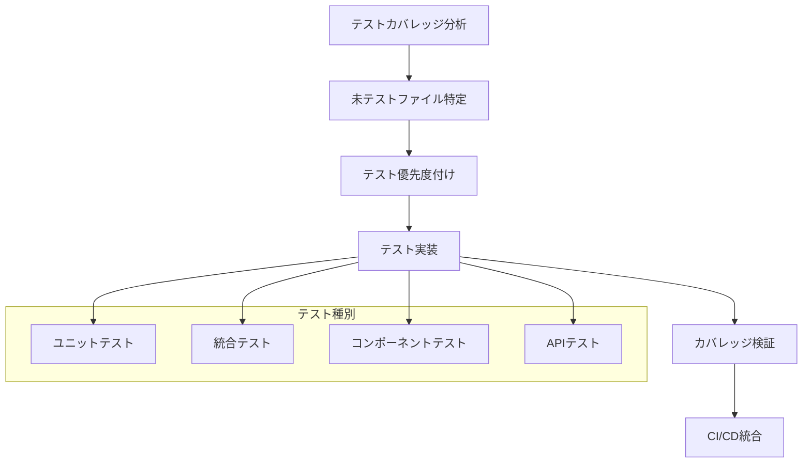

# テストカバレッジ100%達成 - 設計書

## 概要

このプロジェクトは現在112のテストスイートで1624のテストケースを持ち、基本的なテスト基盤は整っています。しかし、カバレッジ100%を達成するためには、未テストのファイル、関数、分岐、行を特定し、体系的にテストを追加する必要があります。

## アーキテクチャ

### テスト戦略アーキテクチャ



### 現在のテスト状況分析

#### 既存テストファイル分布

- **総テストスイート数**: 112
- **総テストケース数**: 1624
- **主要テスト対象**:
  - Portfolio関連: 高いカバレッジ
  - API routes: 部分的カバレッジ
  - Utils/Lib: 良好なカバレッジ
  - Components: 部分的カバレッジ

#### 未テスト領域の特定

1. **App Router Pages**: 多くのページコンポーネントが未テスト
2. **Layout Components**: レイアウト関連コンポーネント
3. **Middleware**: 基本テストのみ
4. **Service Workers**: 未テスト
5. **Error Boundaries**: 部分的テスト
6. **Custom Hooks**: 一部未テスト

## コンポーネントとインターフェース

### 1. テストカバレッジ分析システム

```typescript
interface CoverageAnalyzer {
  analyzeCurrentCoverage(): Promise<CoverageReport>;
  identifyUntestedFiles(): Promise<UntestedFile[]>;
  generateCoverageReport(): Promise<DetailedCoverageReport>;
  validateCoverageThreshold(): Promise<boolean>;
}

interface CoverageReport {
  branches: number;
  functions: number;
  lines: number;
  statements: number;
  files: FileCoverage[];
}

interface UntestedFile {
  path: string;
  type: "component" | "utility" | "api" | "page" | "hook";
  priority: "high" | "medium" | "low";
  estimatedEffort: number;
}
```

### 2. テスト生成システム

```typescript
interface TestGenerator {
  generateComponentTest(filePath: string): Promise<string>;
  generateUtilityTest(filePath: string): Promise<string>;
  generateAPITest(filePath: string): Promise<string>;
  generateIntegrationTest(scenario: TestScenario): Promise<string>;
}

interface TestTemplate {
  type: TestType;
  template: string;
  requiredMocks: string[];
  testCases: TestCase[];
}
```

### 3. テスト実行・検証システム

```typescript
interface TestRunner {
  runAllTests(): Promise<TestResult>;
  runCoverageAnalysis(): Promise<CoverageResult>;
  validateCoverageThreshold(threshold: number): Promise<boolean>;
  generateReports(): Promise<TestReport[]>;
}
```

## データモデル

### テストカバレッジデータ

```typescript
interface TestCoverageData {
  timestamp: Date;
  totalFiles: number;
  testedFiles: number;
  coverage: {
    branches: CoverageMetric;
    functions: CoverageMetric;
    lines: CoverageMetric;
    statements: CoverageMetric;
  };
  untestedFiles: UntestedFile[];
  testSuites: TestSuiteInfo[];
}

interface CoverageMetric {
  total: number;
  covered: number;
  percentage: number;
  uncoveredItems: UncoveredItem[];
}

interface UncoveredItem {
  file: string;
  line: number;
  column: number;
  type: "branch" | "function" | "statement";
  reason: string;
}
```

### テスト優先度マトリックス

```typescript
interface TestPriorityMatrix {
  file: string;
  complexity: "low" | "medium" | "high";
  businessCriticality: "low" | "medium" | "high";
  changeFrequency: "low" | "medium" | "high";
  currentCoverage: number;
  priority: number; // 1-10
  estimatedEffort: number; // hours
}
```

## エラーハンドリング

### テスト実行エラー

```typescript
class TestExecutionError extends Error {
  constructor(
    message: string,
    public testFile: string,
    public testCase: string,
    public originalError: Error,
  ) {
    super(message);
  }
}

class CoverageThresholdError extends Error {
  constructor(
    message: string,
    public currentCoverage: CoverageReport,
    public requiredThreshold: number,
  ) {
    super(message);
  }
}
```

### エラー回復戦略

1. **テスト失敗時**: 詳細なエラーログと修正提案
2. **カバレッジ不足時**: 未テスト箇所の特定と優先度付け
3. **依存関係エラー**: モック戦略の見直し
4. **パフォーマンス問題**: テスト並列化とキャッシュ活用

## テスト戦略

### Phase 1: 基盤整備とカバレッジ分析

#### 1.1 Jest設定の最適化

- カバレッジ閾値を100%に設定
- 詳細なカバレッジレポート生成
- 並列実行の最適化

#### 1.2 カバレッジ分析ツールの実装

- 未テストファイルの自動検出
- カバレッジギャップの可視化
- 優先度付けアルゴリズム

### Phase 2: 未テストファイルの体系的テスト化

#### 2.1 App Router Pages

**対象ファイル**:

- `src/app/about/page.tsx`
- `src/app/contact/page.tsx`
- `src/app/offline/page.tsx`
- `src/app/search/page.tsx`
- `src/app/tools/page.tsx`
- `src/app/workshop/page.tsx`

**テスト戦略**:

- メタデータ生成のテスト
- レンダリングテスト
- SEO要素の検証
- アクセシビリティテスト

#### 2.2 Layout Components

**対象ファイル**:

- `src/app/layout.tsx`
- `src/app/admin/layout.tsx`
- `src/app/tools/layout.tsx`
- `src/app/workshop/layout.tsx`

**テスト戦略**:

- レイアウト構造の検証
- ナビゲーション機能
- レスポンシブ対応
- エラーバウンダリー

#### 2.3 Components

**対象ファイル**:

- `src/components/error-boundaries/ErrorBoundary.tsx`
- `src/components/layout/PageHeader.tsx`
- `src/components/markdown/FallbackContent.tsx`
- `src/components/providers/*`

**テスト戦略**:

- プロパティ検証
- イベントハンドリング
- エラー状態
- コンテキスト提供

#### 2.4 Custom Hooks

**対象ファイル**:

- `src/hooks/useResponsive.ts`
- `src/hooks/useResponsiveCanvas.ts`
- `src/hooks/useTouchGestures.ts`
- `src/hooks/useOfflinePerformance.ts`

**テスト戦略**:

- フック動作の検証
- 依存関係のモック
- 副作用のテスト
- パフォーマンス検証

#### 2.5 Utility Functions

**対象ファイル**:

- `src/lib/utils.ts`
- `src/lib/accessibility/index.ts`
- `src/lib/config/production.ts`
- `src/lib/data/index.ts`

**テスト戦略**:

- 入力値検証
- エッジケーステスト
- エラーハンドリング
- 型安全性

### Phase 3: API Routes完全テスト化

#### 3.1 未テストAPIルート

**対象ディレクトリ**:

- `src/app/api/content/`
- `src/app/api/markdown/`
- `src/app/api/stats/`

**テスト戦略**:

- HTTPメソッド別テスト
- 認証・認可テスト
- エラーレスポンステスト
- パフォーマンステスト

### Phase 4: 統合テストとE2Eテスト強化

#### 4.1 統合テストシナリオ

- ユーザー登録からポートフォリオ作成まで
- 検索機能の完全フロー
- 管理者機能の統合テスト
- パフォーマンス監視の統合

#### 4.2 アクセシビリティテスト

- WCAG 2.1 AA準拠テスト
- キーボードナビゲーション
- スクリーンリーダー対応
- カラーコントラスト

## テスト実装詳細

### テストファイル命名規則

```
src/
├── components/
│   ├── ui/
│   │   ├── Button.tsx
│   │   └── __tests__/
│   │       └── Button.test.tsx
├── lib/
│   ├── utils/
│   │   ├── validation.ts
│   │   └── __tests__/
│   │       └── validation.test.ts
└── app/
    ├── about/
    │   ├── page.tsx
    │   └── __tests__/
    │       └── page.test.tsx
```

### テストテンプレート

#### Reactコンポーネントテスト

```typescript
import { render, screen, fireEvent } from '@testing-library/react';
import { ComponentName } from '../ComponentName';

describe('ComponentName', () => {
  it('should render correctly', () => {
    render(<ComponentName />);
    expect(screen.getByRole('...')).toBeInTheDocument();
  });

  it('should handle props correctly', () => {
    const props = { /* test props */ };
    render(<ComponentName {...props} />);
    // assertions
  });

  it('should handle events correctly', () => {
    const mockHandler = jest.fn();
    render(<ComponentName onEvent={mockHandler} />);
    fireEvent.click(screen.getByRole('button'));
    expect(mockHandler).toHaveBeenCalled();
  });

  it('should handle error states', () => {
    // error state testing
  });
});
```

#### ユーティリティ関数テスト

```typescript
import { utilityFunction } from "../utility";

describe("utilityFunction", () => {
  it("should handle normal input", () => {
    const result = utilityFunction("normal input");
    expect(result).toBe("expected output");
  });

  it("should handle edge cases", () => {
    expect(() => utilityFunction(null)).toThrow();
    expect(utilityFunction("")).toBe("");
  });

  it("should handle async operations", async () => {
    const result = await utilityFunction("async input");
    expect(result).resolves.toBe("expected");
  });
});
```

### モック戦略

#### 外部依存関係のモック

```typescript
// Next.js router
jest.mock("next/navigation", () => ({
  useRouter: () => ({
    push: jest.fn(),
    replace: jest.fn(),
    back: jest.fn(),
  }),
  useSearchParams: () => new URLSearchParams(),
}));

// API calls
jest.mock("@/lib/api", () => ({
  fetchData: jest.fn(),
  postData: jest.fn(),
}));
```

## CI/CD統合

### GitHub Actions設定

```yaml
name: Test Coverage
on: [push, pull_request]

jobs:
  test:
    runs-on: ubuntu-latest
    steps:
      - uses: actions/checkout@v3
      - uses: actions/setup-node@v3
        with:
          node-version: "18"
      - run: npm ci
      - run: npm run test -- --coverage --watchAll=false
      - name: Check coverage threshold
        run: |
          if [ $(npm run test:coverage | grep "All files" | awk '{print $10}' | sed 's/%//') -lt 100 ]; then
            echo "Coverage below 100%"
            exit 1
          fi
      - uses: codecov/codecov-action@v3
        with:
          file: ./coverage/lcov.info
```

### カバレッジレポート生成

```json
{
  "scripts": {
    "test:coverage": "jest --coverage --coverageReporters=text-lcov --coverageReporters=html --coverageReporters=json-summary",
    "test:coverage:watch": "jest --coverage --watch",
    "test:coverage:ci": "jest --coverage --watchAll=false --passWithNoTests"
  }
}
```

## パフォーマンス最適化

### テスト実行の最適化

1. **並列実行**: Jest workers設定
2. **キャッシュ活用**: テスト結果キャッシュ
3. **選択的実行**: 変更ファイルのみテスト
4. **モック最適化**: 重い依存関係のモック化

### メモリ管理

```typescript
// テスト後のクリーンアップ
afterEach(() => {
  jest.clearAllMocks();
  cleanup();
});

afterAll(() => {
  jest.restoreAllMocks();
});
```

## 品質保証

### テストの品質指標

1. **カバレッジ率**: 100%達成
2. **テスト実行時間**: 30秒以内
3. **テスト安定性**: フレーキーテスト0%
4. **メンテナンス性**: 明確なテスト構造

### 継続的改善

1. **定期的なテストレビュー**
2. **テストパフォーマンス監視**
3. **新機能のテスト戦略策定**
4. **テストドキュメントの更新**
