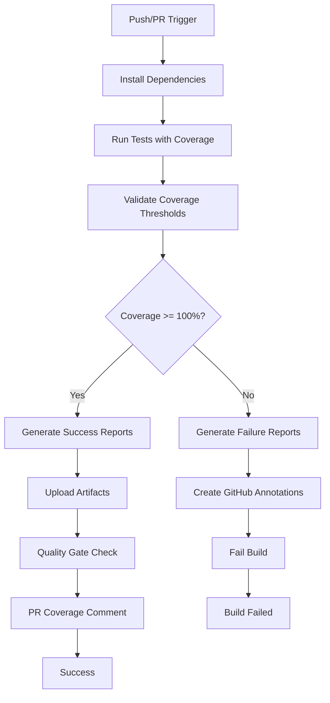

# CI/CD Coverage Implementation Guide

## Overview

This document describes the comprehensive CI/CD pipeline implementation for enforcing 100% test coverage. The implementation includes automated coverage validation, detailed reporting, pull request coverage diff analysis, and failure handling.

## Features Implemented

### 1. GitHub Actions Workflow Enhancement

**File:** `.github/workflows/test-coverage-100.yml`

#### Key Features:

- **Multi-Node Testing**: Tests on Node.js 18.x and 20.x
- **Coverage Enforcement**: Fails build if coverage < 100%
- **Artifact Management**: Saves coverage reports with unique naming
- **PR Coverage Diff**: Compares coverage with base branch
- **Quality Gates**: Multi-stage validation process
- **Trend Tracking**: Tracks coverage trends on main branch

#### Workflow Jobs:

1. **test-coverage**: Main testing and coverage generation
2. **coverage-quality-gate**: Validates coverage thresholds
3. **coverage-report-summary**: Generates final summary

### 2. Coverage Validation Scripts

#### `scripts/validate-coverage.js`

- Validates coverage against 100% threshold
- Generates detailed failure reports
- Creates GitHub Actions annotations
- Provides CI context information
- Generates recommendations for improvement

#### `scripts/ci-coverage-monitor.js`

- Comprehensive CI/CD monitoring
- Advanced failure analysis
- GitHub Actions integration
- Detailed reporting and recommendations
- Error handling and recovery

#### `scripts/coverage-diff.js`

- Compares coverage between branches
- Generates diff analysis
- Provides improvement insights
- Supports local development workflow

#### `scripts/coverage-guide.js`

- Interactive coverage guidance
- File-by-file analysis
- Actionable recommendations
- Command reference

### 3. Package.json Scripts

```json
{
  "test:coverage:100:ci": "CI coverage enforcement for pipelines",
  "test:coverage:validate": "Validate coverage thresholds",
  "test:coverage:ci-monitor": "Comprehensive CI monitoring",
  "test:coverage:diff": "Compare coverage with main branch",
  "test:coverage:guide": "Interactive coverage guidance"
}
```

## CI/CD Pipeline Flow



## Coverage Validation Process

### 1. Threshold Validation

- **Statements**: Must be 100%
- **Branches**: Must be 100%
- **Functions**: Must be 100%
- **Lines**: Must be 100%

### 2. Failure Handling

- Detailed error messages with specific gaps
- GitHub Actions annotations for each failure
- Recommendations for improvement
- Links to coverage reports

### 3. Success Handling

- Success notifications
- Trend tracking (main branch only)
- Artifact preservation

## Pull Request Coverage Diff

### Features:

- **Base Branch Comparison**: Compares with target branch coverage
- **Diff Visualization**: Shows coverage changes with emojis
- **Comment Updates**: Updates existing PR comments instead of creating new ones
- **Artifact Links**: Provides links to detailed reports

### Comment Format:

```markdown
## 📊 Test Coverage Report

| Metric     | Coverage | Status |
| ---------- | -------- | ------ |
| Statements | 100%     | ✅     |
| Branches   | 100%     | ✅     |
| Functions  | 100%     | ✅     |
| Lines      | 100%     | ✅     |

### 📊 Coverage Comparison vs Base Branch

| Metric     | Current | Base | Diff       |
| ---------- | ------- | ---- | ---------- |
| Statements | 100%    | 95%  | +5.00% 📈  |
| Branches   | 100%    | 90%  | +10.00% 📈 |
```

## Artifact Management

### Coverage Reports

- **Retention**: 30 days
- **Formats**: HTML, JSON, LCOV
- **Naming**: Includes Node version and run number
- **Contents**: Complete coverage data and reports

### Test Reports

- **Retention**: 7 days
- **Contents**: Validation results and recommendations
- **Naming**: Timestamped for uniqueness

### Coverage Trends (Main Branch Only)

- **Retention**: 90 days
- **Format**: JSON with timestamp and commit info
- **Purpose**: Long-term coverage trend analysis

## Error Handling and Recovery

### Build Failures

1. **Coverage Below 100%**: Build fails with detailed error messages
2. **Missing Coverage Data**: Build fails with file not found error
3. **Test Failures**: Build fails before coverage validation

### GitHub Actions Annotations

- **Error Annotations**: For each failed metric
- **Notice Annotations**: For successful validation
- **Warning Annotations**: For potential issues

### Recovery Recommendations

- Specific guidance for each type of failure
- Estimated effort for improvements
- Command references for local development

## Local Development Support

### Commands for Developers

```bash
# Run coverage with 100% enforcement
npm run test:coverage:100

# Validate current coverage
npm run test:coverage:validate

# Compare with main branch
npm run test:coverage:diff

# Get interactive guidance
npm run test:coverage:guide

# Monitor coverage (CI-style)
npm run test:coverage:ci-monitor
```

### Coverage Guide Features

- File-by-file analysis
- Worst-performing files identification
- Specific recommendations
- Command references
- Resource links

## Configuration

### Jest Configuration

- **File**: `jest.config.100-coverage.js`
- **Threshold**: 100% for all metrics
- **Reporters**: HTML, JSON, LCOV, text
- **CI Optimization**: Parallel execution, caching

### GitHub Actions Environment Variables

- `CI=true`: Enables CI-specific behavior
- `NODE_ENV=coverage`: Optimizes for coverage collection
- `GITHUB_*`: Provides CI context information

## Monitoring and Reporting

### Success Metrics

- Coverage percentage for each metric
- Number of files with 100% coverage
- Overall coverage score
- Trend analysis (main branch)

### Failure Metrics

- Number of failed metrics
- Coverage gaps for each metric
- Files needing attention
- Estimated effort for improvement

### Report Formats

- **JSON**: Machine-readable data
- **HTML**: Human-readable reports
- **LCOV**: Industry-standard format
- **GitHub Annotations**: CI integration

## Best Practices

### For Developers

1. Run `npm run test:coverage:guide` to understand current status
2. Use `npm run test:coverage:diff` before submitting PRs
3. Focus on high-impact files first (use guide recommendations)
4. Write meaningful tests, not just coverage-driven tests

### For CI/CD

1. Fail fast on coverage issues
2. Provide actionable feedback
3. Preserve artifacts for debugging
4. Track trends over time

### For Maintenance

1. Review coverage trends regularly
2. Update thresholds if needed (currently 100%)
3. Monitor CI performance and optimize as needed
4. Keep documentation updated

## Troubleshooting

### Common Issues

#### "Coverage file not found"

- **Cause**: Tests failed before coverage generation
- **Solution**: Fix test failures first, then check coverage

#### "Quality Gate Failed"

- **Cause**: Coverage below 100% threshold
- **Solution**: Use coverage guide to identify and fix gaps

#### "Artifact upload failed"

- **Cause**: Network issues or large artifact size
- **Solution**: Check artifact size limits and network connectivity

### Debug Commands

```bash
# Check current coverage status
npm run test:coverage:validate

# Generate detailed analysis
npm run test:coverage:guide

# Compare with baseline
npm run test:coverage:diff main

# Run CI monitoring locally
npm run test:coverage:ci-monitor
```

## Future Enhancements

### Planned Features

1. **Coverage Trend Dashboard**: Visual trend analysis
2. **Slack/Teams Integration**: Notifications for coverage changes
3. **Performance Metrics**: Track test execution time
4. **Coverage Heatmaps**: Visual representation of coverage gaps

### Potential Improvements

1. **Smart Test Selection**: Run only tests for changed files
2. **Coverage Prediction**: Predict coverage impact of changes
3. **Automated Test Generation**: Suggest tests for uncovered code
4. **Integration with Code Review**: Inline coverage comments

## Conclusion

This implementation provides a comprehensive solution for enforcing 100% test coverage in CI/CD pipelines. It includes detailed reporting, failure handling, trend tracking, and developer-friendly tools for local development. The system is designed to be maintainable, extensible, and provides clear guidance for achieving and maintaining high test coverage standards.
