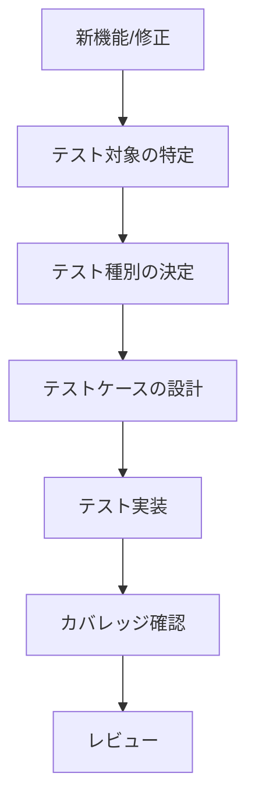

# 新規テスト作成ガイドライン

## 概要

このドキュメントは、新しいテストを作成する際の具体的なガイドラインとテンプレートを提供します。一貫性のあるテストコードを書き、100%カバレッジを維持するための実践的な指針です。

## テスト作成フロー

### 1. テスト対象の分析



### 2. テスト種別の選択

| 対象             | テスト種別     | テンプレート                  |
| ---------------- | -------------- | ----------------------------- |
| React Component  | Component Test | `component.test.template.tsx` |
| Utility Function | Unit Test      | `utility.test.template.ts`    |
| API Route        | API Test       | `api.test.template.ts`        |
| Custom Hook      | Hook Test      | `hook.test.template.ts`       |
| Page Component   | Page Test      | `page.test.template.tsx`      |

## テンプレート集

### React Component テスト

#### ファイル: `templates/component.test.template.tsx`

```typescript
import { render, screen, fireEvent, waitFor } from '@testing-library/react';
import { axe, toHaveNoViolations } from 'jest-axe';
import { ComponentName } from '../ComponentName';
import { createMockProps } from '@/test-utils/mock-factories';

// アクセシビリティテストの拡張
expect.extend(toHaveNoViolations);

describe('ComponentName', () => {
  // デフォルトプロパティ
  const defaultProps = createMockProps();

  // 基本レンダリングテスト
  describe('Rendering', () => {
    it('should render without crashing', () => {
      render(<ComponentName {...defaultProps} />);
      expect(screen.getByRole('...')).toBeInTheDocument();
    });

    it('should render with custom props', () => {
      const customProps = { ...defaultProps, customProp: 'custom value' };
      render(<ComponentName {...customProps} />);
      expect(screen.getByText('custom value')).toBeInTheDocument();
    });

    it('should render loading state', () => {
      const loadingProps = { ...defaultProps, isLoading: true };
      render(<ComponentName {...loadingProps} />);
      expect(screen.getByRole('progressbar')).toBeInTheDocument();
    });

    it('should render error state', () => {
      const errorProps = { ...defaultProps, error: 'Test error' };
      render(<ComponentName {...errorProps} />);
      expect(screen.getByText('Test error')).toBeInTheDocument();
    });
  });

  // プロパティテスト
  describe('Props', () => {
    it('should handle required props correctly', () => {
      const requiredProps = { requiredProp: 'required value' };
      render(<ComponentName {...requiredProps} />);
      expect(screen.getByText('required value')).toBeInTheDocument();
    });

    it('should use default values for optional props', () => {
      render(<ComponentName />);
      // デフォルト値の検証
    });

    it('should validate prop types', () => {
      // TypeScriptで型チェックされるが、ランタイム検証も必要な場合
      const consoleSpy = jest.spyOn(console, 'error').mockImplementation();
      render(<ComponentName invalidProp="invalid" />);
      expect(consoleSpy).toHaveBeenCalled();
      consoleSpy.mockRestore();
    });
  });

  // イベントハンドリングテスト
  describe('Event Handling', () => {
    it('should call onClick handler when clicked', () => {
      const mockOnClick = jest.fn();
      render(<ComponentName {...defaultProps} onClick={mockOnClick} />);

      fireEvent.click(screen.getByRole('button'));
      expect(mockOnClick).toHaveBeenCalledTimes(1);
    });

    it('should call onChange handler with correct value', () => {
      const mockOnChange = jest.fn();
      render(<ComponentName {...defaultProps} onChange={mockOnChange} />);

      fireEvent.change(screen.getByRole('textbox'), {
        target: { value: 'new value' }
      });
      expect(mockOnChange).toHaveBeenCalledWith('new value');
    });

    it('should handle keyboard events', () => {
      const mockOnKeyDown = jest.fn();
      render(<ComponentName {...defaultProps} onKeyDown={mockOnKeyDown} />);

      fireEvent.keyDown(screen.getByRole('button'), { key: 'Enter' });
      expect(mockOnKeyDown).toHaveBeenCalledWith(
        expect.objectContaining({ key: 'Enter' })
      );
    });
  });

  // 状態管理テスト
  describe('State Management', () => {
    it('should update internal state correctly', async () => {
      render(<ComponentName {...defaultProps} />);

      fireEvent.click(screen.getByRole('button', { name: 'Toggle' }));

      await waitFor(() => {
        expect(screen.getByText('Toggled State')).toBeInTheDocument();
      });
    });

    it('should reset state when props change', () => {
      const { rerender } = render(<ComponentName {...defaultProps} />);

      // 状態変更
      fireEvent.click(screen.getByRole('button', { name: 'Change State' }));

      // プロパティ変更で状態リセット
      rerender(<ComponentName {...defaultProps} resetTrigger={true} />);

      expect(screen.queryByText('Changed State')).not.toBeInTheDocument();
    });
  });

  // 副作用テスト
  describe('Side Effects', () => {
    it('should call useEffect on mount', () => {
      const mockEffect = jest.fn();
      render(<ComponentName {...defaultProps} onMount={mockEffect} />);
      expect(mockEffect).toHaveBeenCalledTimes(1);
    });

    it('should cleanup on unmount', () => {
      const mockCleanup = jest.fn();
      const { unmount } = render(
        <ComponentName {...defaultProps} onUnmount={mockCleanup} />
      );

      unmount();
      expect(mockCleanup).toHaveBeenCalledTimes(1);
    });
  });

  // アクセシビリティテスト
  describe('Accessibility', () => {
    it('should have no accessibility violations', async () => {
      const { container } = render(<ComponentName {...defaultProps} />);
      const results = await axe(container);
      expect(results).toHaveNoViolations();
    });

    it('should support keyboard navigation', () => {
      render(<ComponentName {...defaultProps} />);
      const element = screen.getByRole('button');

      element.focus();
      expect(element).toHaveFocus();

      fireEvent.keyDown(element, { key: 'Tab' });
      // 次の要素にフォーカスが移ることを確認
    });

    it('should have proper ARIA attributes', () => {
      render(<ComponentName {...defaultProps} />);
      const element = screen.getByRole('button');

      expect(element).toHaveAttribute('aria-label');
      expect(element).toHaveAttribute('aria-describedby');
    });
  });

  // エラーハンドリングテスト
  describe('Error Handling', () => {
    it('should handle errors gracefully', () => {
      const consoleSpy = jest.spyOn(console, 'error').mockImplementation();

      render(<ComponentName {...defaultProps} shouldThrowError={true} />);

      expect(screen.getByText('Something went wrong')).toBeInTheDocument();
      consoleSpy.mockRestore();
    });

    it('should recover from errors', () => {
      render(<ComponentName {...defaultProps} />);

      // エラー状態にする
      fireEvent.click(screen.getByRole('button', { name: 'Trigger Error' }));
      expect(screen.getByText('Error occurred')).toBeInTheDocument();

      // 回復
      fireEvent.click(screen.getByRole('button', { name: 'Retry' }));
      expect(screen.queryByText('Error occurred')).not.toBeInTheDocument();
    });
  });
});
```

### Utility Function テスト

#### ファイル: `templates/utility.test.template.ts`

```typescript
import { utilityFunction } from "../utility-function";
import { createTestData } from "@/test-utils/mock-factories";

describe("utilityFunction", () => {
  // 正常系テスト
  describe("Normal Cases", () => {
    it("should return expected result for valid input", () => {
      const input = createTestData();
      const result = utilityFunction(input);
      expect(result).toBe(expectedOutput);
    });

    it("should handle multiple valid inputs", () => {
      const testCases = [
        { input: "test1", expected: "result1" },
        { input: "test2", expected: "result2" },
        { input: "test3", expected: "result3" },
      ];

      testCases.forEach(({ input, expected }) => {
        expect(utilityFunction(input)).toBe(expected);
      });
    });
  });

  // 境界値テスト
  describe("Boundary Cases", () => {
    it("should handle empty input", () => {
      expect(utilityFunction("")).toBe("");
    });

    it("should handle null input", () => {
      expect(utilityFunction(null)).toBe(null);
    });

    it("should handle undefined input", () => {
      expect(utilityFunction(undefined)).toBe(undefined);
    });

    it("should handle maximum length input", () => {
      const maxInput = "a".repeat(1000);
      expect(() => utilityFunction(maxInput)).not.toThrow();
    });
  });

  // 異常系テスト
  describe("Error Cases", () => {
    it("should throw error for invalid input type", () => {
      expect(() => utilityFunction(123 as any)).toThrow("Invalid input type");
    });

    it("should throw error for out of range input", () => {
      expect(() => utilityFunction(-1)).toThrow("Input out of range");
    });

    it("should handle network errors gracefully", async () => {
      const mockFetch = jest.fn().mockRejectedValue(new Error("Network error"));
      global.fetch = mockFetch;

      await expect(utilityFunction("test")).rejects.toThrow("Network error");
    });
  });

  // 非同期処理テスト
  describe("Async Operations", () => {
    it("should resolve with correct value", async () => {
      const result = await utilityFunction("async-test");
      expect(result).toBe("async-result");
    });

    it("should handle async errors", async () => {
      await expect(utilityFunction("error-trigger")).rejects.toThrow();
    });

    it("should timeout after specified duration", async () => {
      jest.setTimeout(5000);
      await expect(utilityFunction("timeout-test")).rejects.toThrow("Timeout");
    });
  });

  // パフォーマンステスト
  describe("Performance", () => {
    it("should complete within acceptable time", () => {
      const start = performance.now();
      utilityFunction("performance-test");
      const end = performance.now();

      expect(end - start).toBeLessThan(100); // 100ms以内
    });

    it("should handle large datasets efficiently", () => {
      const largeData = Array.from({ length: 10000 }, (_, i) => i);

      const start = performance.now();
      utilityFunction(largeData);
      const end = performance.now();

      expect(end - start).toBeLessThan(1000); // 1秒以内
    });
  });
});
```

### API Route テスト

#### ファイル: `templates/api.test.template.ts`

```typescript
import { createMocks } from "node-mocks-http";
import handler from "../api/route";
import {
  createMockRequest,
  createMockResponse,
} from "@/test-utils/api-test-helpers";

describe("/api/route", () => {
  // GET リクエストテスト
  describe("GET", () => {
    it("should return 200 with valid data", async () => {
      const { req, res } = createMocks({
        method: "GET",
        query: { id: "1" },
      });

      await handler(req, res);

      expect(res._getStatusCode()).toBe(200);
      expect(JSON.parse(res._getData())).toEqual({
        id: "1",
        data: expect.any(Object),
      });
    });

    it("should return 400 for missing required parameters", async () => {
      const { req, res } = createMocks({
        method: "GET",
        query: {},
      });

      await handler(req, res);

      expect(res._getStatusCode()).toBe(400);
      expect(JSON.parse(res._getData())).toEqual({
        error: "Missing required parameter: id",
      });
    });

    it("should return 404 for non-existent resource", async () => {
      const { req, res } = createMocks({
        method: "GET",
        query: { id: "non-existent" },
      });

      await handler(req, res);

      expect(res._getStatusCode()).toBe(404);
    });
  });

  // POST リクエストテスト
  describe("POST", () => {
    it("should create resource successfully", async () => {
      const testData = { name: "Test", value: "test-value" };
      const { req, res } = createMocks({
        method: "POST",
        body: testData,
      });

      await handler(req, res);

      expect(res._getStatusCode()).toBe(201);
      expect(JSON.parse(res._getData())).toEqual({
        id: expect.any(String),
        ...testData,
        createdAt: expect.any(String),
      });
    });

    it("should validate request body", async () => {
      const invalidData = { name: "" }; // 必須フィールドが空
      const { req, res } = createMocks({
        method: "POST",
        body: invalidData,
      });

      await handler(req, res);

      expect(res._getStatusCode()).toBe(400);
      expect(JSON.parse(res._getData())).toEqual({
        error: "Validation failed",
        details: expect.any(Array),
      });
    });
  });

  // 認証テスト
  describe("Authentication", () => {
    it("should require authentication", async () => {
      const { req, res } = createMocks({
        method: "POST",
        body: { data: "test" },
      });

      await handler(req, res);

      expect(res._getStatusCode()).toBe(401);
    });

    it("should accept valid token", async () => {
      const { req, res } = createMocks({
        method: "POST",
        headers: {
          authorization: "Bearer valid-token",
        },
        body: { data: "test" },
      });

      await handler(req, res);

      expect(res._getStatusCode()).not.toBe(401);
    });
  });

  // エラーハンドリングテスト
  describe("Error Handling", () => {
    it("should handle database errors", async () => {
      // データベースエラーをモック
      jest.spyOn(console, "error").mockImplementation();

      const { req, res } = createMocks({
        method: "GET",
        query: { id: "db-error-trigger" },
      });

      await handler(req, res);

      expect(res._getStatusCode()).toBe(500);
      expect(JSON.parse(res._getData())).toEqual({
        error: "Internal server error",
      });
    });

    it("should handle unsupported methods", async () => {
      const { req, res } = createMocks({
        method: "DELETE",
      });

      await handler(req, res);

      expect(res._getStatusCode()).toBe(405);
      expect(res._getHeaders()).toHaveProperty("allow");
    });
  });
});
```

### Custom Hook テスト

#### ファイル: `templates/hook.test.template.ts`

```typescript
import { renderHook, act } from "@testing-library/react";
import { useCustomHook } from "../useCustomHook";
import { createMockProvider } from "@/test-utils/mock-factories";

describe("useCustomHook", () => {
  // 基本動作テスト
  describe("Basic Functionality", () => {
    it("should return initial state", () => {
      const { result } = renderHook(() => useCustomHook());

      expect(result.current.state).toBe(initialState);
      expect(result.current.isLoading).toBe(false);
      expect(result.current.error).toBe(null);
    });

    it("should update state correctly", () => {
      const { result } = renderHook(() => useCustomHook());

      act(() => {
        result.current.updateState("new value");
      });

      expect(result.current.state).toBe("new value");
    });
  });

  // プロバイダーが必要な場合
  describe("With Provider", () => {
    const wrapper = createMockProvider();

    it("should work with provider context", () => {
      const { result } = renderHook(() => useCustomHook(), { wrapper });

      expect(result.current.contextValue).toBeDefined();
    });
  });

  // 非同期処理テスト
  describe("Async Operations", () => {
    it("should handle async operations", async () => {
      const { result } = renderHook(() => useCustomHook());

      act(() => {
        result.current.fetchData();
      });

      expect(result.current.isLoading).toBe(true);

      await act(async () => {
        await new Promise((resolve) => setTimeout(resolve, 100));
      });

      expect(result.current.isLoading).toBe(false);
      expect(result.current.data).toBeDefined();
    });

    it("should handle async errors", async () => {
      const { result } = renderHook(() => useCustomHook());

      act(() => {
        result.current.fetchData("error-trigger");
      });

      await act(async () => {
        await new Promise((resolve) => setTimeout(resolve, 100));
      });

      expect(result.current.error).toBeTruthy();
      expect(result.current.isLoading).toBe(false);
    });
  });

  // 依存関係テスト
  describe("Dependencies", () => {
    it("should re-run effect when dependencies change", () => {
      const mockEffect = jest.fn();
      const { rerender } = renderHook(
        ({ dep }) => useCustomHook(dep, mockEffect),
        { initialProps: { dep: "initial" } },
      );

      expect(mockEffect).toHaveBeenCalledTimes(1);

      rerender({ dep: "changed" });
      expect(mockEffect).toHaveBeenCalledTimes(2);
    });
  });

  // クリーンアップテスト
  describe("Cleanup", () => {
    it("should cleanup on unmount", () => {
      const mockCleanup = jest.fn();
      const { unmount } = renderHook(() => useCustomHook(mockCleanup));

      unmount();
      expect(mockCleanup).toHaveBeenCalled();
    });
  });
});
```

### Page Component テスト

#### ファイル: `templates/page.test.template.tsx`

```typescript
import { render, screen } from '@testing-library/react';
import { createMockRouter } from '@/test-utils/mock-factories';
import PageComponent from '../page';

// Next.js routerのモック
jest.mock('next/navigation', () => ({
  useRouter: () => createMockRouter(),
  useSearchParams: () => new URLSearchParams(),
  usePathname: () => '/test-page',
}));

describe('PageComponent', () => {
  // メタデータテスト
  describe('Metadata', () => {
    it('should have correct page title', () => {
      render(<PageComponent />);
      expect(document.title).toBe('Expected Page Title');
    });

    it('should have proper meta tags', () => {
      render(<PageComponent />);

      const metaDescription = document.querySelector('meta[name="description"]');
      expect(metaDescription).toHaveAttribute('content', 'Expected description');
    });
  });

  // レンダリングテスト
  describe('Rendering', () => {
    it('should render main content', () => {
      render(<PageComponent />);

      expect(screen.getByRole('main')).toBeInTheDocument();
      expect(screen.getByText('Page Content')).toBeInTheDocument();
    });

    it('should render navigation elements', () => {
      render(<PageComponent />);

      expect(screen.getByRole('navigation')).toBeInTheDocument();
    });
  });

  // SEOテスト
  describe('SEO', () => {
    it('should have proper heading structure', () => {
      render(<PageComponent />);

      const h1 = screen.getByRole('heading', { level: 1 });
      expect(h1).toBeInTheDocument();
    });

    it('should have structured data', () => {
      render(<PageComponent />);

      const structuredData = document.querySelector('script[type="application/ld+json"]');
      expect(structuredData).toBeInTheDocument();
    });
  });

  // アクセシビリティテスト
  describe('Accessibility', () => {
    it('should have proper landmark roles', () => {
      render(<PageComponent />);

      expect(screen.getByRole('main')).toBeInTheDocument();
      expect(screen.getByRole('navigation')).toBeInTheDocument();
    });

    it('should have skip links', () => {
      render(<PageComponent />);

      const skipLink = screen.getByText('Skip to main content');
      expect(skipLink).toBeInTheDocument();
    });
  });
});
```

## テスト作成チェックリスト

### 作成前チェック

- [ ] テスト対象の機能を理解している
- [ ] 適切なテスト種別を選択している
- [ ] 必要な依存関係を特定している
- [ ] テストデータの準備ができている

### 実装中チェック

- [ ] AAA パターンに従っている
- [ ] 適切な命名規則を使用している
- [ ] 必要なモックを設定している
- [ ] エラーケースをテストしている
- [ ] 非同期処理を適切に処理している

### 完了後チェック

- [ ] すべてのテストが通る
- [ ] カバレッジが100%になっている
- [ ] テストが独立して実行できる
- [ ] テストコードが理解しやすい
- [ ] 適切なアサーションを使用している

## コード品質チェック

### ESLint ルール

```javascript
// .eslintrc.js
module.exports = {
  rules: {
    // テスト固有のルール
    "jest/expect-expect": "error",
    "jest/no-disabled-tests": "warn",
    "jest/no-focused-tests": "error",
    "jest/prefer-to-have-length": "warn",
    "jest/valid-expect": "error",

    // Testing Library ルール
    "testing-library/await-async-query": "error",
    "testing-library/no-await-sync-query": "error",
    "testing-library/no-debugging-utils": "warn",
  },
};
```

### テストコードレビューポイント

1. **可読性**: テストの意図が明確か
2. **保守性**: 変更に強いテストか
3. **信頼性**: フレーキーでないか
4. **効率性**: 実行時間は適切か
5. **完全性**: エッジケースをカバーしているか

## 参考リンク

- [Jest Best Practices](https://jestjs.io/docs/tutorial-react)
- [Testing Library Queries](https://testing-library.com/docs/queries/about)
- [React Testing Patterns](https://kentcdodds.com/blog/common-mistakes-with-react-testing-library)
- [API Testing Guide](https://jestjs.io/docs/tutorial-async)
