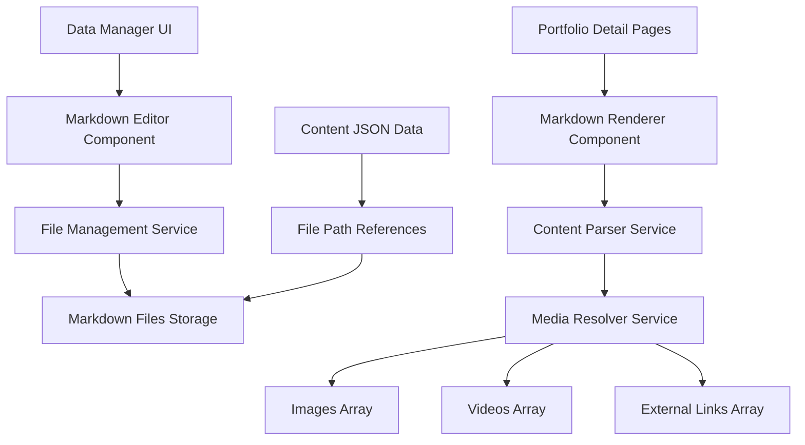

# Design Document

## Overview

このシステムは、現在のポートフォリオコンテンツデータの詳細部分（content フィールド）をMarkdown形式で外部ファイル化し、埋め込みコンテンツをサポートする機能を提供します.業界標準のMarkdown処理パターン（remark/rehype ecosystem）を採用し、パフォーマンスとSEOを重視した実装を行います.

### 参考実装からの学習ポイント

1. **tailwind-nextjs-starter-blog からの学習**
   - MDX + remark/rehype プラグインエコシステムの活用
   - 静的生成時のMarkdown処理とキャッシュ戦略
   - コンテンツメタデータの frontmatter 管理
   - 画像最適化とレスポンシブ対応

2. **tailblaze からの学習**
   - コンポーネントベースのMarkdown拡張
   - Tailwind CSS統合のベストプラクティス
   - 動的コンテンツ読み込みの最適化
   - TypeScript型安全性の確保

### 改善された実装アプローチ

1. **MDX + remark/rehype エコシステム採用**
   - marked.js から remark/rehype への移行
   - プラグインベースの拡張性確保
   - 静的解析とビルド時最適化

2. **フロントマター対応**
   - Markdownファイルにメタデータを埋め込み
   - 型安全なメタデータ管理
   - SEO最適化の自動化

3. **コンポーネント化された埋め込み**
   - カスタムコンポーネントによる埋め込み処理
   - 再利用可能なメディアコンポーネント
   - Tailwind CSS統合の標準化

## Architecture

### システム構成図



### データフロー

1. **作成・編集フロー**
   - データマネージャーでMarkdownエディターを使用してコンテンツを作成
   - ファイル管理サービスが適切なディレクトリにMarkdownファイルを保存
   - JSONデータにはファイルパスのみを格納

2. **表示フロー**
   - 詳細ページがJSONからファイルパスを取得
   - Markdownレンダラーがファイルを読み込み
   - コンテンツパーサーが埋め込み参照を解決
   - メディアリゾルバーが実際のメディアURLに変換

## Components and Interfaces

### 1. Modern Markdown Editor with MDX Support

```typescript
interface MarkdownEditorProps {
  content: string;
  onChange: (content: string) => void;
  onSave: (content: string, filePath: string) => Promise<void>;
  mediaData: MediaData;
  filePath?: string;
  // Modern editor features
  enableMDX?: boolean; // Support for JSX components in markdown
  enableFrontmatter?: boolean; // YAML frontmatter support
  syntaxHighlighting?: boolean;
  livePreview?: boolean;
  splitView?: boolean;
  // Plugin system
  remarkPlugins?: any[];
  rehypePlugins?: any[];
  // UI enhancements
  toolbar?: boolean;
  embedSupport?: boolean;
  showEmbedHelper?: boolean;
  enableAutoComplete?: boolean;
  className?: string;
}

interface EmbedSyntax {
  image:
    | "![image:index]"
    | '![image:index "alt text"]'
    | '![image:index "alt text" class="tailwind-classes"]';
  video:
    | "![video:index]"
    | '![video:index "title"]'
    | '![video:index "title" class="tailwind-classes"]';
  link:
    | "[link:index]"
    | '[link:index "custom text"]'
    | '[link:index "custom text" class="tailwind-classes"]';
  iframe: '<iframe src="url" title="title" class="tailwind-classes" width="100%" height="400"></iframe>';
}

interface EmbedHelper {
  insertImage: (index: number, altText?: string, cssClasses?: string) => void;
  insertVideo: (index: number, title?: string, cssClasses?: string) => void;
  insertLink: (index: number, customText?: string, cssClasses?: string) => void;
  insertIframe: (
    src: string,
    title: string,
    cssClasses?: string,
    width?: string,
    height?: string,
  ) => void;
  suggestTailwindClasses: (
    embedType: "image" | "video" | "link" | "iframe",
  ) => string[];
  validateEmbeds: () => EmbedValidationResult[];
}

interface EmbedValidationResult {
  isValid: boolean;
  line: number;
  column: number;
  message: string;
  suggestion?: string;
  type: "image" | "video" | "link" | "iframe";
}
```

### 2. File Management Service

```typescript
interface FileManagementService {
  createMarkdownFile(contentId: string, content: string): Promise<string>;
  updateMarkdownFile(filePath: string, content: string): Promise<void>;
  deleteMarkdownFile(filePath: string): Promise<void>;
  getMarkdownContent(filePath: string): Promise<string>;
  generateFilePath(contentId: string): string;
}

interface MarkdownFileStructure {
  basePath: "public/data/content/markdown/";
  structure: {
    portfolio: "portfolio/{id}.md";
    download: "download/{id}.md";
    other: "other/{id}.md";
  };
}
```

### 3. Remark/Rehype Based Content Parser

```typescript
interface ModernContentParserService {
  // Core processing with remark/rehype
  processMarkdown(
    content: string,
    options: ProcessingOptions,
  ): Promise<ProcessedContent>;
  parseWithPlugins(content: string, plugins: PluginConfig[]): Promise<string>;

  // Legacy compatibility
  parseMarkdown(content: string, mediaData: MediaData): Promise<string>;
  resolveEmbedReferences(content: string, mediaData: MediaData): string;
  validateEmbedSyntax(
    content: string,
    mediaData: MediaData,
  ): ValidationResult[];
  generateEmbedPreview(
    embedType: string,
    index: number,
    mediaData: MediaData,
  ): string;
  sanitizeIframeContent(iframeHtml: string): string;
}

interface ProcessingOptions {
  enableMDX: boolean;
  enableFrontmatter: boolean;
  mediaData: MediaData;
  remarkPlugins: PluginConfig[];
  rehypePlugins: PluginConfig[];
  sanitizeOptions: SanitizeConfig;
}

interface ProcessedContent {
  html: string;
  frontmatter?: Record<string, any>;
  toc?: TableOfContents;
  readingTime?: number;
  wordCount?: number;
}

interface MediaData {
  images: string[];
  videos: MediaEmbed[];
  externalLinks: ExternalLink[];
}

interface MediaEmbed {
  type: "youtube" | "vimeo" | "local";
  url: string;
  title?: string;
  description?: string;
  thumbnail?: string;
}

interface ExternalLink {
  type: "website" | "github" | "demo" | "booth" | "other";
  url: string;
  title: string;
  description?: string;
}

interface EmbedReference {
  type: "image" | "video" | "link" | "iframe";
  index: number;
  altText?: string;
  customText?: string;
  cssClasses?: string;
  originalMatch: string;
  startPos: number;
  endPos: number;
}

interface ValidationResult {
  isValid: boolean;
  errors: EmbedValidationError[];
  warnings: string[];
}

interface EmbedValidationError {
  line: number;
  column: number;
  message: string;
  suggestion?: string;
  type: "image" | "video" | "link" | "iframe";
  severity: "error" | "warning";
}
```

### 4. Enhanced Markdown Renderer Component

```typescript
interface MarkdownRendererProps {
  filePath: string;
  mediaData: MediaData;
  className?: string;
  onError?: (error: Error) => void;
  fallbackContent?: string;
  showEmptyState?: boolean;
  enableSanitization?: boolean;
}

interface MarkdownRendererState {
  content: string;
  isLoading: boolean;
  error: Error | null;
  parsedContent: string;
  isEmpty: boolean;
  hasValidContent: boolean;
}

interface EmptyStateConfig {
  showBreadcrumb: boolean;
  showBasicInfo: boolean;
  hideDetailsSection: boolean;
  message?: string;
}
```

### 5. Gallery Card Enhancement

```typescript
interface PortfolioCardProps {
  item: PortfolioContentItem;
  onClick: () => void;
  showMarkdownIndicator?: boolean;
  hideMarkdownContent?: boolean; // Always true for gallery cards
}

interface PortfolioCardState {
  hasMarkdownContent: boolean;
  contentPreview?: string; // Only for non-markdown content
}

// Gallery card should never display markdown content
// Only show: title, description, thumbnail, category, tags, metadata
interface GalleryCardContent {
  title: string;
  description: string; // From item.description, NOT from markdown
  thumbnail?: string;
  category: string;
  tags: string[];
  createdAt: string;
  priority?: number;
  hasDetailedContent: boolean; // Indicator that detail page has more content
}
```

## Data Models

### 1. Enhanced Content Item

```typescript
interface EnhancedContentItem extends ContentItem {
  // 既存のcontentフィールドを段階的に置き換え
  content?: string; // 後方互換性のため残す
  markdownPath?: string; // 新しいMarkdownファイルパス
  markdownMigrated?: boolean; // 移行完了フラグ
}
```

### 2. Markdown File Metadata

```typescript
interface MarkdownFileMetadata {
  id: string;
  filePath: string;
  createdAt: string;
  updatedAt: string;
  size: number;
  checksum: string; // ファイル整合性チェック用
}
```

### 3. Embed Resolution Map

```typescript
interface EmbedResolutionMap {
  images: Map<number, string>; // index -> URL
  videos: Map<number, MediaEmbed>; // index -> video data
  links: Map<number, ExternalLink>; // index -> link data
}
```

## Error Handling

### 1. ファイル操作エラー

```typescript
enum MarkdownFileError {
  FILE_NOT_FOUND = "MARKDOWN_FILE_NOT_FOUND",
  PERMISSION_DENIED = "MARKDOWN_PERMISSION_DENIED",
  DISK_FULL = "MARKDOWN_DISK_FULL",
  INVALID_PATH = "MARKDOWN_INVALID_PATH",
}

interface ErrorHandlingStrategy {
  fileNotFound: () => string; // フォールバック表示
  permissionDenied: () => void; // 管理者通知
  diskFull: () => void; // システム警告
  invalidPath: () => void; // パス修正
}
```

### 2. 埋め込み参照エラー

```typescript
interface EmbedError {
  type: "INVALID_INDEX" | "MISSING_MEDIA" | "MALFORMED_SYNTAX";
  line: number;
  column: number;
  message: string;
  suggestion?: string;
}

interface EmbedErrorHandler {
  invalidIndex: (index: number, maxIndex: number) => string;
  missingMedia: (type: string, index: number) => string;
  malformedSyntax: (syntax: string) => string;
}
```

## Testing Strategy

### 1. Unit Tests

```typescript
describe("MarkdownEditor", () => {
  test("should create markdown file on save");
  test("should update existing markdown file");
  test("should validate embed syntax");
  test("should show preview with resolved embeds");
});

describe("ContentParser", () => {
  test("should resolve image references correctly");
  test("should resolve video references correctly");
  test("should resolve link references correctly");
  test("should handle invalid references gracefully");
  test("should preserve iframe embeds");
});

describe("FileManagementService", () => {
  test("should generate unique file paths");
  test("should handle file creation errors");
  test("should clean up orphaned files");
});
```

### 2. Integration Tests

```typescript
describe("Markdown Content System Integration", () => {
  test("should create content with markdown in data manager");
  test("should display markdown content in detail page");
  test("should migrate existing string content to markdown");
  test("should handle concurrent file operations");
  test("should maintain data consistency during migration");
});
```

### 3. E2E Tests

```typescript
describe("Markdown Content E2E", () => {
  test("should create portfolio item with markdown content");
  test("should edit markdown content and see changes");
  test("should embed images using index syntax");
  test("should embed videos using index syntax");
  test("should embed iframes correctly");
  test("should handle markdown file not found gracefully");
});
```

## Implementation Details

### 1. Markdown File Structure

```
public/data/content/markdown/
├── portfolio/
│   ├── portfolio-1753705784056.md
│   ├── portfolio-1753840532952.md
│   └── ...
├── download/
│   └── ...
└── other/
    └── ...
```

### 2. Enhanced Embed Syntax Examples

````markdown
# Portfolio Item Title

This is regular markdown content with enhanced embed support.

## Images

Here's an embedded image: ![image:0]
With alt text: ![image:1 "Screenshot of the application"]
With Tailwind CSS styling: ![image:2 "Mobile view" class="w-full md:w-1/2 rounded-lg shadow-md"]
Responsive grid layout: ![image:3 "Gallery image" class="w-full sm:w-1/2 lg:w-1/3 p-2 rounded-xl"]

## Videos

Embedded video: ![video:0]
With custom title: ![video:1 "Demo video"]
With responsive sizing: ![video:2 "Project demonstration" class="w-full h-64 md:h-96 rounded-lg"]
Aspect ratio control: ![video:3 "Tutorial video" class="aspect-video w-full rounded-lg shadow-lg"]

## Links

External link: [link:0]
With custom text: [link:1 "Visit the project page"]
Styled as button: [link:2 "View source code" class="inline-block bg-blue-500 text-white px-4 py-2 rounded hover:bg-blue-600 transition-colors"]
Badge style: [link:3 "Live Demo" class="bg-green-100 text-green-800 px-2 py-1 rounded-full text-sm font-medium"]

## Custom Embeds

<iframe src="https://example.com/embed" title="Custom embed" class="w-full h-96 rounded-lg border-0" allowfullscreen></iframe>
<iframe src="https://codepen.io/example" title="CodePen Demo" class="w-full h-64 md:h-80 rounded-lg shadow-md border border-gray-200"></iframe>

## Advanced Features

### Code Blocks with Syntax Highlighting

```javascript
function embedResolver(content, mediaData) {
  return content.replace(
    /!\[image:(\d+)(?:\s+"([^"]*)")?\]/g,
    (match, index, alt) => {
      const imageUrl = mediaData.images[parseInt(index)];
      return imageUrl ? `` : match;
    },
  );
}
```
````

### Tables

| Feature       | Status | Notes                 |
| ------------- | ------ | --------------------- |
| Image Embeds  | ✅     | Supports alt text     |
| Video Embeds  | ✅     | YouTube, Vimeo, local |
| Link Embeds   | ✅     | Custom text support   |
| Iframe Embeds | ✅     | Sanitized content     |

### Blockquotes

> This is a blockquote that will be styled consistently with the site design.
> It supports multiple lines and **markdown formatting**.

````

### 3. Migration Strategy

```typescript
interface MigrationPlan {
  phase1: {
    description: "Add markdown support alongside existing content";
    actions: [
      "Add markdownPath field to content items",
      "Implement markdown editor in data manager",
      "Add markdown renderer to detail pages",
    ];
  };
  phase2: {
    description: "Migrate existing content to markdown files";
    actions: [
      "Create migration script for existing content",
      "Update data manager to prefer markdown over content",
      "Add migration status tracking",
    ];
  };
  phase3: {
    description: "Complete migration and cleanup";
    actions: [
      "Remove content field dependency",
      "Clean up unused content fields",
      "Optimize file structure",
    ];
  };
}
````

### 4. Data Manager Integration

```typescript
interface DataManagerFormEnhancements {
  markdownEditor: {
    component: MarkdownEditor;
    features: {
      livePreview: boolean;
      syntaxHighlighting: boolean;
      embedHelper: boolean;
      autoComplete: boolean;
      validation: boolean;
    };
  };
  migrationHelper: {
    showMigrationButton: boolean;
    oneClickMigration: () => Promise<void>;
    migrationStatus: "needed" | "in-progress" | "completed" | "error";
  };
  contentManagement: {
    autoSave: boolean;
    filePathGeneration: (id: string, type: string) => string;
    backupOnEdit: boolean;
  };
}

interface MigrationProcess {
  detectLegacyContent: (item: ContentItem) => boolean;
  migrateToMarkdown: (item: ContentItem) => Promise<EnhancedContentItem>;
  updateDataReferences: (item: EnhancedContentItem) => Promise<void>;
  cleanupLegacyContent: (item: EnhancedContentItem) => Promise<void>;
}
```

### 5. Gallery Display Optimization

```typescript
interface GalleryDisplayRules {
  // Gallery cards should NEVER display markdown content
  cardContent: {
    allowedFields: [
      "title",
      "description",
      "thumbnail",
      "category",
      "tags",
      "createdAt",
      "priority",
    ];
    forbiddenFields: ["content", "markdownPath", "markdownContent"];
    maxDescriptionLength: 150;
    showContentIndicator: boolean; // Show if item has detailed content
  };

  // Detail pages should display full markdown content
  detailContent: {
    showFullMarkdown: boolean;
    fallbackToDescription: boolean;
    showEmptyState: boolean;
    maintainPageStructure: boolean;
  };
}

interface ContentIndicator {
  show: boolean;
  icon: string; // e.g., "📄" or custom icon
  tooltip: string; // "View detailed content"
  position: "top-right" | "bottom-right" | "badge";
}
```

### 6. Performance Considerations

- **ファイルキャッシュ**: 頻繁にアクセスされるMarkdownファイルをメモリキャッシュ
- **遅延読み込み**: 詳細ページでのMarkdownファイル読み込みを最適化
- **バッチ処理**: 複数ファイルの一括操作をサポート
- **ファイルサイズ制限**: Markdownファイルのサイズ制限を設定（推奨: 1MB以下）
- **ギャラリー最適化**: ギャラリーカードでmarkdownコンテンツを読み込まない
- **プリロード**: 詳細ページ遷移時のmarkdownファイルプリロード

### 7. Tailwind CSS Integration

```typescript
interface TailwindClassSupport {
  // Supported class categories for each embed type
  imageClasses: {
    sizing: [
      "w-full",
      "w-1/2",
      "w-1/3",
      "w-1/4",
      "h-auto",
      "h-32",
      "h-64",
      "h-96",
    ];
    spacing: ["p-2", "p-4", "m-2", "m-4", "mx-auto", "my-4"];
    borders: [
      "rounded",
      "rounded-lg",
      "rounded-xl",
      "border",
      "border-gray-200",
    ];
    shadows: ["shadow", "shadow-md", "shadow-lg", "shadow-xl"];
    responsive: ["sm:w-1/2", "md:w-1/3", "lg:w-1/4", "xl:w-1/5"];
  };
  videoClasses: {
    sizing: ["w-full", "h-64", "h-96", "aspect-video", "aspect-square"];
    spacing: ["p-2", "p-4", "m-2", "m-4", "mx-auto", "my-4"];
    borders: ["rounded", "rounded-lg", "rounded-xl"];
    shadows: ["shadow", "shadow-md", "shadow-lg"];
    responsive: ["sm:h-48", "md:h-64", "lg:h-96"];
  };
  linkClasses: {
    colors: ["text-blue-500", "text-green-600", "bg-blue-500", "bg-green-500"];
    spacing: ["px-2", "px-4", "py-1", "py-2", "mx-2", "my-1"];
    borders: ["rounded", "rounded-lg", "rounded-full", "border"];
    typography: ["text-sm", "text-base", "font-medium", "font-bold"];
    states: ["hover:bg-blue-600", "hover:text-white", "transition-colors"];
  };
  iframeClasses: {
    sizing: ["w-full", "h-64", "h-96", "aspect-video"];
    borders: ["rounded", "rounded-lg", "border-0", "border", "border-gray-200"];
    shadows: ["shadow", "shadow-md", "shadow-lg"];
    responsive: ["sm:h-48", "md:h-64", "lg:h-96"];
  };
}

interface ClassSuggestionEngine {
  getCommonClasses: (
    embedType: "image" | "video" | "link" | "iframe",
  ) => string[];
  getResponsiveClasses: (
    embedType: "image" | "video" | "link" | "iframe",
  ) => string[];
  validateClasses: (classes: string[]) => {
    valid: string[];
    invalid: string[];
  };
  suggestAlternatives: (invalidClass: string) => string[];
}

// Embed syntax parser with Tailwind support
interface EmbedSyntaxParser {
  parseImageEmbed: (match: string) => {
    index: number;
    altText?: string;
    classes?: string[];
  };
  parseVideoEmbed: (match: string) => {
    index: number;
    title?: string;
    classes?: string[];
  };
  parseLinkEmbed: (match: string) => {
    index: number;
    customText?: string;
    classes?: string[];
  };
  parseIframeEmbed: (match: string) => {
    src: string;
    title?: string;
    classes?: string[];
    attributes: Record<string, string>;
  };
}
```

### 8. Security Considerations

- **パストラバーサル防止**: ファイルパスの検証を実装
- **XSS防止**: Markdownレンダリング時のサニタイゼーション（DOMPurify使用）
- **iframe制限**: 許可されたドメインのみiframe埋め込み可能
- **ファイル権限**: 適切なファイル権限設定
- **コンテンツ検証**: 埋め込み参照の境界チェック
- **CSP対応**: Content Security Policyに準拠したiframe処理
- **CSS クラス検証**: 許可されたTailwind CSSクラスのみを受け入れ
- **クラス サニタイゼーション**: 悪意のあるCSSクラスの除去
