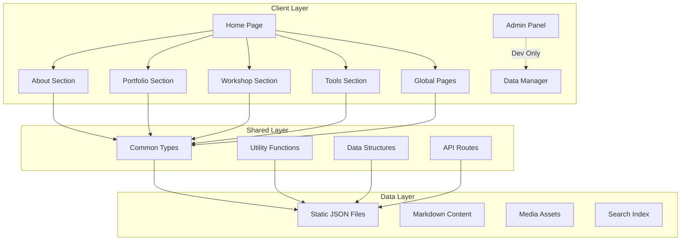

# Design Document

## Overview

The samuido website is a comprehensive personal portfolio platform built with Next.js 15.4.3, designed as a collection of independent page-sites that share common data structures and utilities. The architecture prioritizes page-level independence, exceptional performance (100% test scores), and flexible content management while maintaining a cohesive user experience across all sections.

### Core Design Principles

1. **Page Independence**: Each major section (About, Portfolio, Workshop, Tools, Admin) operates as an independent site with its own components and styling
2. **Shared Foundation**: Common data structures, utilities, and type definitions are shared across all pages
3. **Performance First**: All implementations must achieve 100% scores in testing, linting, and performance metrics
4. **Accessibility Focus**: Enhanced accessibility for tools section due to widespread usage potential
5. **Offline Capability**: All tools and core functionality work without internet connection
6. **Flexible Architecture**: Easy modification and extension of site structure over time

## Architecture

### High-Level Architecture



### Technology Stack

- **Framework**: Next.js 15.4.3 with App Router
- **Language**: TypeScript 5.x
- **Styling**: Tailwind CSS 4.x with custom design system
- **UI Libraries**: Lucide React (icons), Framer Motion (animations)
- **3D/Canvas**: Three.js, PIXI.js for interactive content
- **Content**: Markdown with embedded media support
- **Search**: Fuse.js for client-side fuzzy search
- **Email**: Resend API for contact forms
- **Image Processing**: ffmpeg.wasm for admin panel
- **Testing**: Jest, Playwright, Lighthouse CI
- **Deployment**: GitHub Actions → GCP VM with Apache

### Directory Structure

```
src/
├── app/                          # Next.js App Router
│   ├── (root)/                   # Home page group
│   │   └── page.tsx
│   ├── about/                    # About section
│   │   ├── components/           # About-specific components
│   │   ├── profile/
│   │   │   ├── real/page.tsx
│   │   │   ├── handle/page.tsx
│   │   │   └── AI/page.tsx
│   │   ├── card/
│   │   │   ├── real/page.tsx
│   │   │   └── handle/page.tsx
│   │   ├── commission/
│   │   │   ├── develop/page.tsx
│   │   │   ├── video/page.tsx
│   │   │   └── estimate/page.tsx
│   │   ├── links/page.tsx
│   │   └── page.tsx
│   ├── portfolio/                # Portfolio section
│   │   ├── components/           # Portfolio-specific components
│   │   ├── gallery/
│   │   │   ├── all/page.tsx
│   │   │   ├── develop/page.tsx
│   │   │   ├── video/page.tsx
│   │   │   └── video&design/page.tsx
│   │   ├── detail/
│   │   │   ├── develop/page.tsx
│   │   │   ├── video/page.tsx
│   │   │   └── video&design/page.tsx
│   │   ├── playground/
│   │   │   ├── design/page.tsx
│   │   │   └── WebGL/page.tsx
│   │   ├── [slug]/page.tsx       # Dynamic portfolio items
│   │   └── page.tsx
│   ├── workshop/                 # Workshop section
│   │   ├── components/           # Workshop-specific components
│   │   ├── blog/page.tsx
│   │   ├── plugins/page.tsx
│   │   ├── downloads/page.tsx
│   │   └── page.tsx
│   ├── tools/                    # Tools section
│   │   ├── components/           # Tools-specific components
│   │   ├── color-palette/page.tsx
│   │   ├── qr-generator/page.tsx
│   │   ├── text-counter/page.tsx
│   │   ├── svg2tsx/page.tsx
│   │   ├── sequential-png-preview/page.tsx
│   │   ├── pomodoro/page.tsx
│   │   ├── pi-game/page.tsx
│   │   ├── business-mail-block/page.tsx
│   │   ├── ae-expression/page.tsx
│   │   ├── ProtoType/page.tsx
│   │   └── page.tsx
│   ├── admin/                    # Admin section (dev only)
│   │   ├── components/           # Admin-specific components
│   │   ├── data-manager/page.tsx
│   │   └── page.tsx
│   ├── contact/page.tsx          # Global contact page
│   ├── search/page.tsx           # Global search page
│   ├── privacy-policy/page.tsx   # Global privacy policy
│   ├── not-found.tsx             # 404 page
│   ├── api/                      # API routes
│   │   ├── content/
│   │   │   ├── [type]/route.ts
│   │   │   └── search/route.ts
│   │   ├── stats/
│   │   │   ├── download/route.ts
│   │   │   └── view/route.ts
│   │   ├── contact/route.ts
│   │   ├── admin/
│   │   │   ├── content/route.ts
│   │   │   └── upload/route.ts
│   │   └── health/route.ts
│   ├── globals.css               # Global styles
│   └── layout.tsx                # Root layout
├── lib/                          # Shared utilities
│   ├── utils/                    # Utility functions
│   │   ├── performance.ts
│   │   ├── validation.ts
│   │   ├── error-handling.ts
│   │   ├── color.ts
│   │   ├── storage.ts
│   │   └── date.ts
│   ├── search/                   # Search functionality
│   │   └── index.ts
│   ├── stats/                    # Statistics management
│   │   └── index.ts
│   └── email/                    # Email utilities
│       └── index.ts
├── types/                        # TypeScript definitions
│   ├── content.ts
│   ├── site-config.ts
│   ├── form-config.ts
│   └── navigation.ts
└── components/                   # Shared utilities only
    └── ui/                       # Basic utility components
```

## Components and Interfaces

### Core Data Structures

#### ContentItem Interface

```typescript
interface ContentItem {
  id: string;
  type: ContentType;
  title: string;
  description: string;
  category: string;
  tags: string[];
  status: "published" | "draft" | "archived" | "scheduled";
  priority: number;
  createdAt: string;
  updatedAt?: string;
  publishedAt?: string;
  thumbnail?: string;
  images?: string[];
  videos?: MediaEmbed[];
  externalLinks?: ExternalLink[];
  downloadInfo?: DownloadInfo;
  content?: string;
  contentPath?: string;
  stats?: ContentStats;
  seo?: SEOData;
  customFields?: Record<string, any>;
}

type ContentType =
  | "portfolio"
  | "plugin"
  | "blog"
  | "profile"
  | "page"
  | "tool"
  | "asset"
  | "download";
```

#### SiteConfig Interface

```typescript
interface SiteConfig {
  name: string;
  description: string;
  url: string;
  language: string;
  author: AuthorInfo;
  theme: ThemeConfig;
  features: FeatureConfig;
  integrations: IntegrationConfig;
  seo: GlobalSEOConfig;
}
```

### Page-Specific Component Architecture

#### Home Page Components

- **HeroSection**: Site overview and introduction
- **CategoryCards**: Navigation to main sections
- **GlobalFunctionCards**: Privacy Policy, Search, Contact
- **LatestContentHighlights**: Recent content from all sections

#### About Section Components

- **ProfileDisplay**: Real/Handle/AI profile information
- **SkillsShowcase**: Technical skills and achievements
- **DigitalBusinessCard**: QR code-enabled contact cards
- **CommissionInfo**: Service offerings and pricing
- **AchievementsList**: Awards and recognition
- **ExternalLinksMap**: Social media and portfolio links

#### Portfolio Section Components

- **PortfolioGallery**: Category-filtered work display
- **PortfolioDetail**: Individual work detailed view
- **CategoryFilter**: Dynamic filtering by type and tags
- **MediaViewer**: Image/video content display
- **PlaygroundViewer**: Interactive WebGL/design demos
- **TechStackDisplay**: Technology tags and details

#### Workshop Section Components

- **BlogList**: Article listing with search
- **BlogDetail**: Markdown content with embedded media
- **PluginGallery**: Plugin download interface
- **DownloadManager**: File download with statistics
- **ContentSearch**: Full-text search across content
- **VersionManager**: Plugin version tracking

#### Tools Section Components

- **ToolsGrid**: Overview of all available tools
- **ColorPaletteGenerator**: HSV-based color generation
- **QRCodeGenerator**: Customizable QR code creation
- **TextCounter**: Multi-language text analysis
- **SVGToTSXConverter**: React component generation
- **SequentialPNGPreview**: Animation preview tool
- **PomodoroTimer**: Productivity timer
- **PiGame**: Educational memory game
- **BusinessMailBuilder**: Email template creator
- **AEExpressionHelper**: After Effects utility
- **ProtoTypeGame**: PIXI.js typing game

#### Admin Section Components (Development Only)

- **DataManager**: Content CRUD interface
- **FileUploader**: Media file management
- **ImageProcessor**: ffmpeg.wasm integration
- **OGPManager**: Social media image management
- **FaviconManager**: Site icon management
- **PreviewGenerator**: Real-time content preview
- **JSONExporter**: Data export functionality

### Shared Utility Components

#### Performance Utilities

```typescript
// Dynamic imports for heavy components
export const LazyComponents = {
  ColorPalette: lazy(() => import("@/app/tools/components/ColorPalette")),
  ThreeJSPlayground: lazy(
    () => import("@/app/portfolio/components/ThreeJSPlayground"),
  ),
  ProtoType: lazy(() => import("@/app/tools/components/ProtoType")),
  SequentialPngPreview: lazy(
    () => import("@/app/tools/components/SequentialPngPreview"),
  ),
};

// Memory management for 3D components
export const memoryOptimization = {
  disposeThreeObjects: (scene: any) => {
    scene.traverse((child: any) => {
      if (child.geometry) child.geometry.dispose();
      if (child.material) {
        if (child.material.map) child.material.map.dispose();
        child.material.dispose();
      }
    });
  },
};
```

#### Search Integration

```typescript
export const searchContent = async (
  query: string,
  options: {
    type?: ContentType;
    category?: string;
    limit?: number;
    includeContent?: boolean;
  } = {},
): Promise<SearchResult[]> => {
  // Fuse.js implementation with content filtering
};
```

## Data Models

### File-Based Data Storage

#### Data Directory Structure

```
public/data/
├── content/
│   ├── portfolio.json      # Portfolio items
│   ├── blog.json          # Blog posts
│   ├── plugin.json        # Plugin information
│   ├── download.json      # Download materials
│   ├── tool.json          # Tool configurations
│   └── profile.json       # Profile information
├── stats/
│   ├── download-stats.json # Download tracking
│   ├── view-stats.json     # Page view tracking
│   └── search-stats.json   # Search analytics
└── cache/
    ├── search-index.json   # Search index cache
    └── site-map.json       # Generated sitemap
```

#### Media Organization

```
public/
├── images/
│   ├── portfolio/          # Portfolio work images
│   ├── thumbnails/         # Auto-generated thumbnails
│   ├── og-images/          # Social media images
│   └── profile/            # Profile photos
├── videos/                 # Video content
├── downloads/              # Downloadable files
└── favicons/               # Site icons
```

### Content Management Flow

1. **Admin Input**: Content created via data-manager interface
2. **Processing**: Images processed with ffmpeg.wasm
3. **Storage**: JSON data updated, Markdown files generated
4. **Indexing**: Search index automatically updated
5. **Deployment**: Static files deployed with site

### SEO Data Structure

Each page maintains independent SEO configuration:

```typescript
interface PageSEO {
  title: string;
  description: string;
  keywords: string[];
  canonical: string;
  ogImage: string;
  twitterImage: string;
  structuredData: Record<string, any>;
  robots: string;
  locale: string;
}
```

## Error Handling

### Error Classification

```typescript
export class ContentError extends Error {
  constructor(
    message: string,
    public code: string,
    public details?: any,
  ) {
    super(message);
    this.name = "ContentError";
  }
}

export const errorHandler = {
  handleApiError: (error: any): AppError => {
    if (error instanceof ContentError) {
      return {
        code: error.code,
        message: error.message,
        details: error.details,
        timestamp: new Date().toISOString(),
      };
    }
    return {
      code: "UNKNOWN_ERROR",
      message: "An unexpected error occurred",
      details: error.message,
      timestamp: new Date().toISOString(),
    };
  },
};
```

### Error Boundaries

- **Page-Level**: Each major section has error boundary
- **Component-Level**: Critical components have individual error handling
- **API-Level**: Comprehensive API error responses
- **User-Friendly**: Clear error messages for end users

### Fallback Strategies

1. **Content Loading**: Graceful degradation when content fails
2. **Search Failure**: Basic filtering when search index unavailable
3. **Media Loading**: Placeholder images for failed loads
4. **Tool Errors**: Clear error states with recovery options

## Testing Strategy

### Testing Pyramid

#### Unit Tests (Jest)

- **Coverage Target**: 100% of utility functions and data processing
- **Focus Areas**:
  - Data validation and transformation
  - Search functionality
  - Color generation algorithms
  - Text processing utilities
  - Error handling logic

#### Integration Tests (Playwright)

- **API Testing**: All API endpoints with various scenarios
- **Form Testing**: Contact forms, admin interfaces
- **Navigation Testing**: All routing and deep linking
- **Search Testing**: Search functionality across content types

#### End-to-End Tests (Playwright)

- **Critical User Journeys**:
  1. Home → Portfolio → Detail view
  2. Tools → Color Palette → Generate and export
  3. Workshop → Blog → Content reading
  4. About → Commission → Contact form
  5. Search → Results → Content access

#### Performance Tests (Lighthouse CI)

- **Metrics Target**: 100% scores in all categories
- **Core Web Vitals**: LCP ≤ 2.5s, FID ≤ 100ms, CLS ≤ 0.1
- **Accessibility**: WCAG 2.1 AA compliance
- **SEO**: Complete meta data and structured data

#### Quality Assurance

- **Linting**: ESLint with zero errors and warnings
- **Formatting**: Prettier with consistent code style
- **Type Checking**: TypeScript strict mode compliance
- **Content Linting**: Textlint for Markdown content

### Testing Environment Setup

```typescript
// jest.config.js
module.exports = {
  testEnvironment: "jsdom",
  setupFilesAfterEnv: ["<rootDir>/jest.setup.js"],
  moduleNameMapping: {
    "^@/(.*)$": "<rootDir>/src/$1",
  },
  collectCoverageFrom: [
    "src/**/*.{ts,tsx}",
    "!src/**/*.d.ts",
    "!src/**/*.stories.{ts,tsx}",
  ],
  coverageThreshold: {
    global: {
      branches: 100,
      functions: 100,
      lines: 100,
      statements: 100,
    },
  },
};
```

### Continuous Testing

- **Pre-commit**: Lint and type check
- **Pull Request**: Full test suite + Lighthouse
- **Main Branch**: Complete test suite + deployment
- **Scheduled**: Weekly comprehensive testing

## Performance Optimization

### Core Web Vitals Strategy

#### Largest Contentful Paint (LCP) ≤ 2.5s

- **Image Optimization**: Next.js Image with WebP format
- **Critical CSS**: Inline critical styles
- **Font Loading**: Preload essential fonts
- **Code Splitting**: Dynamic imports for heavy components

#### First Input Delay (FID) ≤ 100ms

- **JavaScript Optimization**: Minimize main thread blocking
- **Event Handler Optimization**: Efficient event processing
- **Third-party Scripts**: Defer non-critical scripts
- **Service Worker**: Cache critical resources

#### Cumulative Layout Shift (CLS) ≤ 0.1

- **Image Dimensions**: Explicit width/height attributes
- **Font Loading**: Prevent font swap layout shifts
- **Dynamic Content**: Reserve space for dynamic elements
- **Ad Placement**: No ads, but reserve space for dynamic tools

### Bundle Optimization

```typescript
// next.config.ts
const nextConfig = {
  experimental: {
    optimizeCss: true,
    optimizePackageImports: ["lucide-react"],
  },
  images: {
    formats: ["image/webp", "image/avif"],
    deviceSizes: [640, 750, 828, 1080, 1200, 1920, 2048, 3840],
  },
  compiler: {
    removeConsole: process.env.NODE_ENV === "production",
  },
};
```

### Caching Strategy

- **Static Assets**: 1 year cache with immutable headers
- **Dynamic Content**: 1 hour cache with revalidation
- **API Responses**: Appropriate cache headers per endpoint
- **Search Index**: 12 hour cache with background updates

### Memory Management

```typescript
// Cleanup for Three.js components
useEffect(() => {
  return () => {
    if (sceneRef.current) {
      memoryOptimization.disposeThreeObjects(sceneRef.current);
    }
  };
}, []);
```

## Security Considerations

### Content Security Policy

```typescript
const csp = `
  default-src 'self';
  script-src 'self' 'unsafe-inline' https://www.googletagmanager.com https://www.google-analytics.com https://www.gstatic.com;
  style-src 'self' 'unsafe-inline' https://fonts.googleapis.com;
  font-src 'self' https://fonts.gstatic.com;
  img-src 'self' data: https: blob:;
  connect-src 'self' https://www.google-analytics.com;
  frame-src https://www.google.com;
`;
```

### Input Validation

```typescript
export const validators = {
  email: (value: string): boolean => {
    const emailRegex = /^[^\s@]+@[^\s@]+\.[^\s@]+$/;
    return emailRegex.test(value);
  },
  required: (value: any): boolean => {
    return value !== null && value !== undefined && value !== "";
  },
  fileType: (file: File, allowedTypes: string[]): boolean => {
    return allowedTypes.includes(file.type);
  },
  fileSize: (file: File, maxSize: number): boolean => {
    return file.size <= maxSize;
  },
};
```

### Rate Limiting

- **API Endpoints**: 60 requests per minute
- **Contact Form**: 3 requests per 15 minutes
- **Download Tracking**: 10 requests per hour
- **Search API**: 30 requests per minute

### Data Sanitization

```typescript
import DOMPurify from "isomorphic-dompurify";

export const sanitizeInput = (input: string): string => {
  return DOMPurify.sanitize(input, {
    ALLOWED_TAGS: ["b", "i", "em", "strong", "a"],
    ALLOWED_ATTR: ["href"],
  });
};
```

## Accessibility Implementation

### WCAG 2.1 AA Compliance

#### Keyboard Navigation

- **Tab Order**: Logical tab sequence throughout site
- **Focus Management**: Visible focus indicators
- **Skip Links**: Skip to main content functionality
- **Keyboard Shortcuts**: Tool-specific keyboard shortcuts

#### Screen Reader Support

- **Semantic HTML**: Proper heading hierarchy and landmarks
- **ARIA Labels**: Comprehensive labeling for interactive elements
- **Alt Text**: Descriptive alternative text for all images
- **Live Regions**: Dynamic content announcements

#### Visual Accessibility

- **Color Contrast**: Minimum 4.5:1 ratio for normal text
- **Color Independence**: Information not conveyed by color alone
- **Text Scaling**: Support up to 200% zoom
- **Motion Preferences**: Respect prefers-reduced-motion

### Tools Section Enhanced Accessibility

Given the widespread usage potential of tools:

```typescript
// Enhanced accessibility for tools
const ToolWrapper = ({ children, toolName }: ToolWrapperProps) => {
  return (
    <div
      role="application"
      aria-label={`${toolName} tool`}
      className="focus-within:ring-2 focus-within:ring-blue-500"
    >
      <h1 className="sr-only">{toolName} Tool</h1>
      {children}
    </div>
  );
};
```

### Accessibility Testing

- **Automated Testing**: axe-core integration in tests
- **Manual Testing**: Keyboard-only navigation testing
- **Screen Reader Testing**: NVDA/JAWS compatibility
- **Color Blind Testing**: Various color vision simulations

## Internationalization Considerations

### Japanese Content Support

- **Font Loading**: Proper Japanese font stack
- **Text Direction**: Left-to-right layout
- **Character Encoding**: UTF-8 throughout
- **Input Methods**: Japanese IME support

### Content Structure

```typescript
interface LocalizedContent {
  ja: {
    title: string;
    description: string;
    content: string;
  };
  en?: {
    title: string;
    description: string;
    content: string;
  };
}
```

### SEO Localization

- **hreflang**: Proper language declarations
- **Structured Data**: Localized schema markup
- **Meta Tags**: Language-specific meta information
- **URL Structure**: Language-neutral URLs where possible

This design document provides the foundation for implementing a high-performance, accessible, and maintainable personal portfolio website that meets all specified requirements while maintaining flexibility for future enhancements.
