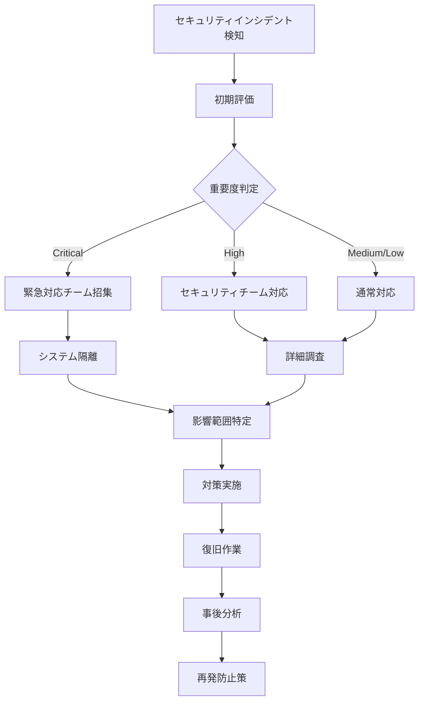

# ポートフォリオシステム 保守・運用体制整備ガイド

## 概要

このドキュメントでは、拡張されたポートフォリオコンテンツデータ管理システムの保守・運用体制について説明します。システムの安定稼働、セキュリティ維持、パフォーマンス最適化のための包括的な運用手順を定義します。

## 目次

1. [エラー監視システムの設定](#エラー監視システムの設定)
2. [ログ分析システムの構築](#ログ分析システムの構築)
3. [バックアップ・復旧手順の整備](#バックアップ復旧手順の整備)
4. [セキュリティ監査体制の構築](#セキュリティ監査体制の構築)
5. [定期メンテナンス手順の作成](#定期メンテナンス手順の作成)
6. [運用チェックリスト](#運用チェックリスト)

---

## エラー監視システムの設定

### 監視対象とアラート設定

#### 1. アプリケーションエラー監視

**監視項目**:

- JavaScript実行エラー
- API呼び出しエラー
- データベース接続エラー
- ファイル操作エラー
- 認証・認可エラー

**アラート設定**:

```javascript
// エラー監視設定例
const errorMonitoring = {
  // 重要度: 高 - 即座にアラート
  critical: {
    triggers: [
      "database_connection_failed",
      "authentication_system_down",
      "file_system_full",
    ],
    notification: {
      methods: ["email", "slack", "sms"],
      recipients: ["admin@example.com", "dev-team@example.com"],
      escalation: "5分以内に対応がない場合、管理者に電話",
    },
  },

  // 重要度: 中 - 30分以内にアラート
  warning: {
    triggers: [
      "api_response_time_slow",
      "file_upload_failure_rate_high",
      "memory_usage_high",
    ],
    notification: {
      methods: ["email", "slack"],
      recipients: ["dev-team@example.com"],
      escalation: "2時間以内に対応",
    },
  },

  // 重要度: 低 - 日次レポート
  info: {
    triggers: [
      "user_login_failure",
      "validation_error",
      "cache_miss_rate_high",
    ],
    notification: {
      methods: ["email"],
      recipients: ["dev-team@example.com"],
      schedule: "daily_report",
    },
  },
};
```

#### 2. システムリソース監視

**監視項目**:

- CPU使用率（閾値: 80%以上で警告、90%以上で緊急）
- メモリ使用率（閾値: 85%以上で警告、95%以上で緊急）
- ディスク使用率（閾値: 80%以上で警告、90%以上で緊急）
- ネットワーク帯域使用率
- データベース接続数

**監視スクリプト例**:

```bash
#!/bin/bash
# system-monitor.sh

# CPU使用率チェック
CPU_USAGE=$(top -bn1 | grep "Cpu(s)" | awk '{print $2}' | awk -F'%' '{print $1}')
if (( $(echo "$CPU_USAGE > 80" | bc -l) )); then
    echo "WARNING: CPU usage is ${CPU_USAGE}%" | mail -s "System Alert" admin@example.com
fi

# メモリ使用率チェック
MEMORY_USAGE=$(free | grep Mem | awk '{printf("%.2f", $3/$2 * 100.0)}')
if (( $(echo "$MEMORY_USAGE > 85" | bc -l) )); then
    echo "WARNING: Memory usage is ${MEMORY_USAGE}%" | mail -s "System Alert" admin@example.com
fi

# ディスク使用率チェック
DISK_USAGE=$(df -h / | awk 'NR==2 {print $5}' | sed 's/%//')
if [ $DISK_USAGE -gt 80 ]; then
    echo "WARNING: Disk usage is ${DISK_USAGE}%" | mail -s "System Alert" admin@example.com
fi
```

#### 3. アプリケーション固有の監視

**ポートフォリオシステム固有の監視項目**:

- データマネージャーの応答時間
- ファイルアップロード成功率
- マークダウンファイル読み込み成功率
- ギャラリー表示の応答時間
- タグ検索の応答時間

**監視設定**:

```javascript
// アプリケーション監視設定
const appMonitoring = {
  dataManager: {
    responseTime: { threshold: 2000, unit: "ms" },
    errorRate: { threshold: 5, unit: "percent" },
  },
  fileUpload: {
    successRate: { threshold: 95, unit: "percent" },
    averageUploadTime: { threshold: 30000, unit: "ms" },
  },
  markdownFiles: {
    readSuccessRate: { threshold: 98, unit: "percent" },
    cacheHitRate: { threshold: 80, unit: "percent" },
  },
  gallery: {
    loadTime: { threshold: 3000, unit: "ms" },
    filterResponseTime: { threshold: 1000, unit: "ms" },
  },
};
```

### 監視ツールの設定

#### 1. ログ監視ツール設定

**推奨ツール**: ELK Stack (Elasticsearch, Logstash, Kibana)

**Logstash設定例**:

```ruby
# logstash.conf
input {
  file {
    path => "/var/log/portfolio-app/*.log"
    start_position => "beginning"
    codec => "json"
  }
}

filter {
  if [level] == "ERROR" {
    mutate {
      add_tag => ["error"]
    }
  }

  if [message] =~ /database/ {
    mutate {
      add_tag => ["database"]
    }
  }

  if [message] =~ /file.*upload/ {
    mutate {
      add_tag => ["file_upload"]
    }
  }
}

output {
  elasticsearch {
    hosts => ["localhost:9200"]
    index => "portfolio-logs-%{+YYYY.MM.dd}"
  }

  if "error" in [tags] {
    email {
      to => "admin@example.com"
      subject => "Portfolio System Error Alert"
      body => "Error detected: %{message}"
    }
  }
}
```

#### 2. アプリケーション監視ダッシュボード

**Kibana ダッシュボード設定**:

```json
{
  "dashboard": {
    "title": "Portfolio System Monitoring",
    "panels": [
      {
        "title": "Error Rate Over Time",
        "type": "line_chart",
        "query": "level:ERROR",
        "timeframe": "last_24h"
      },
      {
        "title": "API Response Times",
        "type": "histogram",
        "query": "api_endpoint:*",
        "field": "response_time"
      },
      {
        "title": "File Upload Success Rate",
        "type": "pie_chart",
        "query": "operation:file_upload",
        "field": "status"
      },
      {
        "title": "Top Error Messages",
        "type": "table",
        "query": "level:ERROR",
        "aggregation": "count",
        "field": "message"
      }
    ]
  }
}
```

---

## ログ分析システムの構築

### ログ収集・分析戦略

#### 1. ログレベルと分類

**ログレベル定義**:

```javascript
const LOG_LEVELS = {
  ERROR: 0, // システムエラー、即座の対応が必要
  WARN: 1, // 警告、監視が必要
  INFO: 2, // 一般的な情報、運用状況の把握
  DEBUG: 3, // デバッグ情報、開発時のみ
};

// ログカテゴリ
const LOG_CATEGORIES = {
  SYSTEM: "system", // システム全般
  AUTH: "authentication", // 認証・認可
  DATA: "data_management", // データ操作
  FILE: "file_operations", // ファイル操作
  API: "api_requests", // API呼び出し
  SECURITY: "security", // セキュリティ関連
  PERFORMANCE: "performance", // パフォーマンス
};
```

#### 2. 構造化ログフォーマット

**標準ログフォーマット**:

```json
{
  "timestamp": "2024-02-01T10:30:00.000Z",
  "level": "ERROR",
  "category": "data_management",
  "message": "Failed to save portfolio item",
  "context": {
    "user_id": "user123",
    "item_id": "portfolio456",
    "operation": "save",
    "error_code": "DB_CONNECTION_FAILED"
  },
  "stack_trace": "Error: Connection timeout...",
  "request_id": "req_789",
  "session_id": "sess_abc"
}
```

#### 3. ログ分析クエリ例

**よく使用する分析クエリ**:

```elasticsearch
# エラー率の時系列分析
GET portfolio-logs-*/_search
{
  "query": {
    "range": {
      "timestamp": {
        "gte": "now-24h"
      }
    }
  },
  "aggs": {
    "error_rate_over_time": {
      "date_histogram": {
        "field": "timestamp",
        "interval": "1h"
      },
      "aggs": {
        "error_count": {
          "filter": {
            "term": {
              "level": "ERROR"
            }
          }
        }
      }
    }
  }
}

# 最も頻繁なエラーメッセージ
GET portfolio-logs-*/_search
{
  "query": {
    "bool": {
      "must": [
        {"term": {"level": "ERROR"}},
        {"range": {"timestamp": {"gte": "now-7d"}}}
      ]
    }
  },
  "aggs": {
    "top_errors": {
      "terms": {
        "field": "message.keyword",
        "size": 10
      }
    }
  }
}

# ユーザー別エラー分析
GET portfolio-logs-*/_search
{
  "query": {
    "bool": {
      "must": [
        {"term": {"level": "ERROR"}},
        {"exists": {"field": "context.user_id"}}
      ]
    }
  },
  "aggs": {
    "errors_by_user": {
      "terms": {
        "field": "context.user_id.keyword",
        "size": 20
      }
    }
  }
}
```

### ログ分析自動化

#### 1. 日次レポート生成

**レポート生成スクリプト**:

```python
#!/usr/bin/env python3
# daily_log_report.py

import json
import smtplib
from datetime import datetime, timedelta
from elasticsearch import Elasticsearch
from email.mime.text import MIMEText
from email.mime.multipart import MIMEMultipart

class LogAnalyzer:
    def __init__(self):
        self.es = Elasticsearch(['localhost:9200'])

    def generate_daily_report(self):
        yesterday = datetime.now() - timedelta(days=1)
        date_str = yesterday.strftime('%Y-%m-%d')

        report = {
            'date': date_str,
            'total_requests': self.get_total_requests(yesterday),
            'error_count': self.get_error_count(yesterday),
            'top_errors': self.get_top_errors(yesterday),
            'performance_metrics': self.get_performance_metrics(yesterday),
            'security_events': self.get_security_events(yesterday)
        }

        return report

    def get_total_requests(self, date):
        query = {
            "query": {
                "range": {
                    "timestamp": {
                        "gte": date.strftime('%Y-%m-%d'),
                        "lt": (date + timedelta(days=1)).strftime('%Y-%m-%d')
                    }
                }
            }
        }

        result = self.es.count(index="portfolio-logs-*", body=query)
        return result['count']

    def get_error_count(self, date):
        query = {
            "query": {
                "bool": {
                    "must": [
                        {"term": {"level": "ERROR"}},
                        {"range": {
                            "timestamp": {
                                "gte": date.strftime('%Y-%m-%d'),
                                "lt": (date + timedelta(days=1)).strftime('%Y-%m-%d')
                            }
                        }}
                    ]
                }
            }
        }

        result = self.es.count(index="portfolio-logs-*", body=query)
        return result['count']

    def send_report(self, report):
        msg = MIMEMultipart()
        msg['From'] = 'system@example.com'
        msg['To'] = 'admin@example.com'
        msg['Subject'] = f'Portfolio System Daily Report - {report["date"]}'

        body = f"""
        Portfolio System Daily Report - {report['date']}

        Summary:
        - Total Requests: {report['total_requests']}
        - Error Count: {report['error_count']}
        - Error Rate: {(report['error_count'] / report['total_requests'] * 100):.2f}%

        Top Errors:
        {json.dumps(report['top_errors'], indent=2)}

        Performance Metrics:
        {json.dumps(report['performance_metrics'], indent=2)}

        Security Events:
        {json.dumps(report['security_events'], indent=2)}
        """

        msg.attach(MIMEText(body, 'plain'))

        server = smtplib.SMTP('localhost', 587)
        server.send_message(msg)
        server.quit()

if __name__ == "__main__":
    analyzer = LogAnalyzer()
    report = analyzer.generate_daily_report()
    analyzer.send_report(report)
```

#### 2. 異常検知アルゴリズム

**異常検知スクリプト**:

```python
# anomaly_detection.py

import numpy as np
from sklearn.ensemble import IsolationForest
from elasticsearch import Elasticsearch

class AnomalyDetector:
    def __init__(self):
        self.es = Elasticsearch(['localhost:9200'])
        self.model = IsolationForest(contamination=0.1)

    def detect_anomalies(self):
        # 過去7日間のメトリクスを取得
        metrics = self.get_metrics_data()

        # 異常検知モデルで分析
        anomalies = self.model.fit_predict(metrics)

        # 異常なデータポイントを特定
        anomaly_indices = np.where(anomalies == -1)[0]

        if len(anomaly_indices) > 0:
            self.alert_anomalies(anomaly_indices, metrics)

    def get_metrics_data(self):
        # エラー率、応答時間、リクエスト数などのメトリクスを取得
        query = {
            "query": {
                "range": {
                    "timestamp": {
                        "gte": "now-7d"
                    }
                }
            },
            "aggs": {
                "hourly_metrics": {
                    "date_histogram": {
                        "field": "timestamp",
                        "interval": "1h"
                    },
                    "aggs": {
                        "error_rate": {
                            "filter": {"term": {"level": "ERROR"}}
                        },
                        "avg_response_time": {
                            "avg": {"field": "response_time"}
                        }
                    }
                }
            }
        }

        result = self.es.search(index="portfolio-logs-*", body=query)

        # メトリクスデータを配列に変換
        metrics = []
        for bucket in result['aggregations']['hourly_metrics']['buckets']:
            metrics.append([
                bucket['error_rate']['doc_count'],
                bucket['avg_response_time']['value'] or 0
            ])

        return np.array(metrics)

    def alert_anomalies(self, anomaly_indices, metrics):
        # 異常検知時のアラート送信
        message = f"Anomaly detected in system metrics: {len(anomaly_indices)} anomalous data points found"
        # アラート送信処理...
```

---

## バックアップ・復旧手順の整備

### バックアップ戦略

#### 1. データベースバックアップ

**自動バックアップスクリプト**:

```bash
#!/bin/bash
# database_backup.sh

# 設定
DB_NAME="portfolio_db"
BACKUP_DIR="/backup/database"
RETENTION_DAYS=30
DATE=$(date +%Y%m%d_%H%M%S)

# バックアップディレクトリ作成
mkdir -p $BACKUP_DIR

# データベースダンプ
pg_dump $DB_NAME > $BACKUP_DIR/portfolio_db_$DATE.sql

# 圧縮
gzip $BACKUP_DIR/portfolio_db_$DATE.sql

# 古いバックアップの削除（30日以上前）
find $BACKUP_DIR -name "*.sql.gz" -mtime +$RETENTION_DAYS -delete

# バックアップ結果の確認
if [ $? -eq 0 ]; then
    echo "Database backup completed successfully: portfolio_db_$DATE.sql.gz"
    # 成功通知
    echo "Database backup completed" | mail -s "Backup Success" admin@example.com
else
    echo "Database backup failed"
    # 失敗通知
    echo "Database backup failed" | mail -s "Backup Failed" admin@example.com
fi
```

#### 2. ファイルシステムバックアップ

**ファイルバックアップスクリプト**:

```bash
#!/bin/bash
# file_backup.sh

# 設定
SOURCE_DIRS=(
    "/var/www/portfolio/public/data"
    "/var/www/portfolio/public/uploads"
    "/var/www/portfolio/public/images"
    "/var/www/portfolio/documents"
)
BACKUP_DIR="/backup/files"
DATE=$(date +%Y%m%d_%H%M%S)

# バックアップディレクトリ作成
mkdir -p $BACKUP_DIR

# 各ディレクトリのバックアップ
for dir in "${SOURCE_DIRS[@]}"; do
    if [ -d "$dir" ]; then
        dir_name=$(basename $dir)
        tar -czf $BACKUP_DIR/${dir_name}_$DATE.tar.gz -C $(dirname $dir) $(basename $dir)
        echo "Backed up: $dir -> ${dir_name}_$DATE.tar.gz"
    else
        echo "Warning: Directory not found: $dir"
    fi
done

# 古いバックアップの削除
find $BACKUP_DIR -name "*.tar.gz" -mtime +30 -delete

echo "File backup completed"
```

#### 3. 設定ファイルバックアップ

**設定バックアップスクリプト**:

```bash
#!/bin/bash
# config_backup.sh

CONFIG_DIRS=(
    "/etc/nginx"
    "/var/www/portfolio/.env"
    "/var/www/portfolio/package.json"
    "/var/www/portfolio/next.config.js"
)
BACKUP_DIR="/backup/config"
DATE=$(date +%Y%m%d_%H%M%S)

mkdir -p $BACKUP_DIR

# 設定ファイルのバックアップ
tar -czf $BACKUP_DIR/config_$DATE.tar.gz "${CONFIG_DIRS[@]}"

echo "Configuration backup completed: config_$DATE.tar.gz"
```

### 復旧手順

#### 1. データベース復旧

**復旧手順書**:

```bash
# データベース復旧手順

# 1. サービス停止
sudo systemctl stop portfolio-app
sudo systemctl stop nginx

# 2. 現在のデータベースのバックアップ（念のため）
pg_dump portfolio_db > /tmp/current_db_backup.sql

# 3. データベースの削除と再作成
dropdb portfolio_db
createdb portfolio_db

# 4. バックアップからの復元
gunzip -c /backup/database/portfolio_db_YYYYMMDD_HHMMSS.sql.gz | psql portfolio_db

# 5. データ整合性チェック
psql portfolio_db -c "SELECT COUNT(*) FROM portfolio_items;"
psql portfolio_db -c "SELECT COUNT(*) FROM tags;"

# 6. サービス再開
sudo systemctl start portfolio-app
sudo systemctl start nginx

# 7. 動作確認
curl -f http://localhost:3000/api/health || echo "Health check failed"
```

#### 2. ファイル復旧

**ファイル復旧手順**:

```bash
# ファイル復旧手順

# 1. サービス停止
sudo systemctl stop portfolio-app

# 2. 現在のファイルのバックアップ
tar -czf /tmp/current_files_backup.tar.gz /var/www/portfolio/public/data

# 3. バックアップからの復元
cd /var/www/portfolio/public
tar -xzf /backup/files/data_YYYYMMDD_HHMMSS.tar.gz

# 4. 権限の修正
chown -R www-data:www-data /var/www/portfolio/public/data
chmod -R 755 /var/www/portfolio/public/data

# 5. サービス再開
sudo systemctl start portfolio-app

# 6. 動作確認
# ファイルアクセステスト
curl -f http://localhost:3000/api/files/test || echo "File access test failed"
```

#### 3. 完全システム復旧

**災害復旧手順書**:

```markdown
# 災害復旧手順書

## 前提条件

- 新しいサーバーまたはクリーンな環境
- バックアップファイルへのアクセス
- 必要な権限とアクセス情報

## 復旧手順

### Phase 1: システム環境構築

1. OS基本設定
2. 必要なソフトウェアのインストール
   - Node.js
   - PostgreSQL
   - Nginx
3. ユーザーアカウント作成

### Phase 2: アプリケーション復旧

1. アプリケーションコードのデプロイ
2. 依存関係のインストール
3. 環境変数の設定

### Phase 3: データ復旧

1. データベース復旧
2. ファイルシステム復旧
3. 設定ファイル復旧

### Phase 4: 動作確認

1. サービス起動確認
2. 機能テスト実行
3. パフォーマンステスト

### Phase 5: 本番切り替え

1. DNS切り替え
2. SSL証明書設定
3. 監視システム設定

## 復旧時間目標 (RTO)

- データベース復旧: 30分以内
- ファイル復旧: 1時間以内
- 完全システム復旧: 4時間以内

## 復旧ポイント目標 (RPO)

- データ損失許容時間: 1時間以内
```

---

## セキュリティ監査体制の構築

### セキュリティ監査計画

#### 1. 定期監査スケジュール

**監査スケジュール**:

```yaml
security_audit_schedule:
  daily:
    - access_log_review
    - failed_login_attempts
    - suspicious_activity_detection

  weekly:
    - vulnerability_scan
    - security_patch_review
    - user_access_review

  monthly:
    - penetration_testing
    - security_configuration_review
    - incident_response_drill

  quarterly:
    - comprehensive_security_assessment
    - third_party_security_audit
    - security_policy_review

  annually:
    - security_architecture_review
    - disaster_recovery_testing
    - compliance_audit
```

#### 2. セキュリティチェックリスト

**日次セキュリティチェック**:

```bash
#!/bin/bash
# daily_security_check.sh

echo "=== Daily Security Check - $(date) ==="

# 1. 失敗したログイン試行の確認
echo "Checking failed login attempts..."
FAILED_LOGINS=$(grep "authentication failed" /var/log/portfolio-app/auth.log | wc -l)
if [ $FAILED_LOGINS -gt 10 ]; then
    echo "WARNING: High number of failed login attempts: $FAILED_LOGINS"
    # アラート送信
fi

# 2. 異常なファイルアクセスの確認
echo "Checking suspicious file access..."
find /var/www/portfolio -name "*.php" -o -name "*.jsp" -o -name "*.asp" | while read file; do
    echo "ALERT: Suspicious file found: $file"
done

# 3. システムファイルの整合性チェック
echo "Checking system file integrity..."
if command -v aide >/dev/null 2>&1; then
    aide --check
fi

# 4. ネットワーク接続の確認
echo "Checking network connections..."
netstat -tuln | grep LISTEN | while read line; do
    echo "Open port: $line"
done

# 5. プロセス確認
echo "Checking running processes..."
ps aux | grep -E "(nc|netcat|nmap)" | grep -v grep && echo "ALERT: Suspicious network tools detected"

echo "=== Security Check Completed ==="
```

#### 3. 脆弱性スキャン

**自動脆弱性スキャンスクリプト**:

```python
#!/usr/bin/env python3
# vulnerability_scan.py

import subprocess
import json
import smtplib
from email.mime.text import MIMEText
from datetime import datetime

class VulnerabilityScanner:
    def __init__(self):
        self.results = []

    def scan_dependencies(self):
        """依存関係の脆弱性スキャン"""
        try:
            # npm audit
            result = subprocess.run(['npm', 'audit', '--json'],
                                  capture_output=True, text=True, cwd='/var/www/portfolio')

            if result.returncode != 0:
                audit_data = json.loads(result.stdout)
                vulnerabilities = audit_data.get('vulnerabilities', {})

                for vuln_name, vuln_info in vulnerabilities.items():
                    if vuln_info.get('severity') in ['high', 'critical']:
                        self.results.append({
                            'type': 'dependency',
                            'name': vuln_name,
                            'severity': vuln_info.get('severity'),
                            'description': vuln_info.get('title', ''),
                            'recommendation': 'Update dependency'
                        })
        except Exception as e:
            print(f"Dependency scan failed: {e}")

    def scan_web_application(self):
        """Webアプリケーションの脆弱性スキャン"""
        # OWASP ZAP を使用した例
        try:
            result = subprocess.run([
                'zap-cli', 'quick-scan', 'http://localhost:3000',
                '--self-contained', '--start-options', '-config api.disablekey=true'
            ], capture_output=True, text=True)

            if result.returncode == 0:
                # スキャン結果の解析
                lines = result.stdout.split('\n')
                for line in lines:
                    if 'High' in line or 'Medium' in line:
                        self.results.append({
                            'type': 'web_application',
                            'description': line.strip(),
                            'severity': 'high' if 'High' in line else 'medium',
                            'recommendation': 'Review and fix identified issues'
                        })
        except Exception as e:
            print(f"Web application scan failed: {e}")

    def scan_system_configuration(self):
        """システム設定の脆弱性チェック"""
        checks = [
            {
                'name': 'SSH Configuration',
                'command': ['grep', '-E', '^PermitRootLogin|^PasswordAuthentication', '/etc/ssh/sshd_config'],
                'expected': ['PermitRootLogin no', 'PasswordAuthentication no']
            },
            {
                'name': 'Firewall Status',
                'command': ['ufw', 'status'],
                'expected': ['Status: active']
            }
        ]

        for check in checks:
            try:
                result = subprocess.run(check['command'], capture_output=True, text=True)
                if result.returncode == 0:
                    output = result.stdout.strip()
                    for expected in check['expected']:
                        if expected not in output:
                            self.results.append({
                                'type': 'system_configuration',
                                'name': check['name'],
                                'severity': 'medium',
                                'description': f'Expected configuration not found: {expected}',
                                'recommendation': 'Review system configuration'
                            })
            except Exception as e:
                print(f"System configuration check failed: {e}")

    def generate_report(self):
        """脆弱性レポート生成"""
        if not self.results:
            return "No vulnerabilities found."

        report = f"Vulnerability Scan Report - {datetime.now().strftime('%Y-%m-%d %H:%M:%S')}\n"
        report += "=" * 60 + "\n\n"

        # 重要度別に分類
        critical = [r for r in self.results if r.get('severity') == 'critical']
        high = [r for r in self.results if r.get('severity') == 'high']
        medium = [r for r in self.results if r.get('severity') == 'medium']

        if critical:
            report += "CRITICAL VULNERABILITIES:\n"
            for vuln in critical:
                report += f"- {vuln.get('name', vuln.get('description'))}\n"
                report += f"  Recommendation: {vuln.get('recommendation')}\n\n"

        if high:
            report += "HIGH SEVERITY VULNERABILITIES:\n"
            for vuln in high:
                report += f"- {vuln.get('name', vuln.get('description'))}\n"
                report += f"  Recommendation: {vuln.get('recommendation')}\n\n"

        if medium:
            report += "MEDIUM SEVERITY VULNERABILITIES:\n"
            for vuln in medium:
                report += f"- {vuln.get('name', vuln.get('description'))}\n"
                report += f"  Recommendation: {vuln.get('recommendation')}\n\n"

        return report

    def send_report(self, report):
        """レポート送信"""
        msg = MIMEText(report)
        msg['Subject'] = 'Security Vulnerability Scan Report'
        msg['From'] = 'security@example.com'
        msg['To'] = 'admin@example.com'

        server = smtplib.SMTP('localhost', 587)
        server.send_message(msg)
        server.quit()

if __name__ == "__main__":
    scanner = VulnerabilityScanner()
    scanner.scan_dependencies()
    scanner.scan_web_application()
    scanner.scan_system_configuration()

    report = scanner.generate_report()
    print(report)
    scanner.send_report(report)
```

### セキュリティインシデント対応

#### 1. インシデント対応手順

**インシデント対応フローチャート**:



#### 2. インシデント対応チェックリスト

**緊急時対応チェックリスト**:

```markdown
# セキュリティインシデント対応チェックリスト

## Phase 1: 初期対応 (0-30分)

- [ ] インシデント検知時刻の記録
- [ ] 初期評価の実施
- [ ] 関係者への通知
- [ ] 証拠保全の開始
- [ ] 必要に応じてシステム隔離

## Phase 2: 調査・分析 (30分-2時間)

- [ ] 詳細ログ分析
- [ ] 影響範囲の特定
- [ ] 攻撃手法の分析
- [ ] 被害状況の評価
- [ ] 外部機関への報告検討

## Phase 3: 対策・復旧 (2-8時間)

- [ ] 脆弱性の修正
- [ ] セキュリティパッチ適用
- [ ] システム復旧
- [ ] 動作確認
- [ ] 監視強化

## Phase 4: 事後対応 (1-2週間)

- [ ] 詳細報告書作成
- [ ] 再発防止策の策定
- [ ] セキュリティポリシー見直し
- [ ] 関係者への報告
- [ ] 教訓の共有
```

---

## 定期メンテナンス手順の作成

### メンテナンススケジュール

#### 1. 定期メンテナンス計画

**メンテナンススケジュール**:

```yaml
maintenance_schedule:
  daily:
    time: "02:00"
    duration: "30min"
    tasks:
      - log_rotation
      - temporary_file_cleanup
      - cache_optimization
      - health_check

  weekly:
    day: "Sunday"
    time: "02:00"
    duration: "2hours"
    tasks:
      - database_optimization
      - index_rebuild
      - backup_verification
      - security_updates
      - performance_analysis

  monthly:
    day: "First Sunday"
    time: "02:00"
    duration: "4hours"
    tasks:
      - full_system_backup
      - dependency_updates
      - security_audit
      - capacity_planning
      - disaster_recovery_test

  quarterly:
    duration: "8hours"
    tasks:
      - major_updates
      - architecture_review
      - performance_optimization
      - security_assessment
```

#### 2. 日次メンテナンススクリプト

**日次メンテナンス**:

```bash
#!/bin/bash
# daily_maintenance.sh

echo "=== Daily Maintenance Started - $(date) ==="

# 1. ログローテーション
echo "Rotating logs..."
logrotate /etc/logrotate.d/portfolio-app

# 2. 一時ファイルクリーンアップ
echo "Cleaning temporary files..."
find /tmp -name "portfolio-*" -mtime +1 -delete
find /var/www/portfolio/tmp -name "*" -mtime +1 -delete

# 3. キャッシュ最適化
echo "Optimizing cache..."
# Redis キャッシュクリーンアップ
redis-cli FLUSHDB

# 4. データベース統計更新
echo "Updating database statistics..."
psql portfolio_db -c "ANALYZE;"

# 5. ディスク使用量チェック
echo "Checking disk usage..."
df -h | awk '$5 > 80 {print "WARNING: " $0}'

# 6. ヘルスチェック
echo "Performing health check..."
curl -f http://localhost:3000/api/health || echo "Health check failed"

# 7. パフォーマンスメトリクス収集
echo "Collecting performance metrics..."
echo "$(date): $(ps aux | grep node | grep -v grep | awk '{sum+=$3} END {print "CPU:", sum"%"}')" >> /var/log/performance.log
echo "$(date): $(free -m | grep Mem | awk '{print "Memory:", $3"/"$2"MB"}')" >> /var/log/performance.log

echo "=== Daily Maintenance Completed - $(date) ==="
```

#### 3. 週次メンテナンススクリプト

**週次メンテナンス**:

```bash
#!/bin/bash
# weekly_maintenance.sh

echo "=== Weekly Maintenance Started - $(date) ==="

# 1. データベース最適化
echo "Optimizing database..."
psql portfolio_db -c "VACUUM ANALYZE;"
psql portfolio_db -c "REINDEX DATABASE portfolio_db;"

# 2. バックアップ検証
echo "Verifying backups..."
LATEST_BACKUP=$(ls -t /backup/database/*.sql.gz | head -1)
if [ -f "$LATEST_BACKUP" ]; then
    echo "Latest backup found: $LATEST_BACKUP"
    # バックアップファイルの整合性チェック
    gunzip -t "$LATEST_BACKUP" && echo "Backup integrity OK" || echo "Backup integrity FAILED"
else
    echo "ERROR: No backup files found"
fi

# 3. セキュリティアップデート
echo "Checking for security updates..."
apt list --upgradable | grep -i security

# 4. パフォーマンス分析
echo "Analyzing performance..."
# 過去1週間のレスポンス時間分析
awk '/response_time/ {sum+=$NF; count++} END {print "Average response time:", sum/count "ms"}' /var/log/portfolio-app/access.log

# 5. ログ分析
echo "Analyzing logs..."
# エラー率計算
TOTAL_REQUESTS=$(grep -c "HTTP" /var/log/nginx/access.log)
ERROR_REQUESTS=$(grep -c " 5[0-9][0-9] " /var/log/nginx/access.log)
ERROR_RATE=$(echo "scale=2; $ERROR_REQUESTS * 100 / $TOTAL_REQUESTS" | bc)
echo "Error rate: $ERROR_RATE%"

# 6. 容量監視
echo "Monitoring capacity..."
du -sh /var/www/portfolio/public/uploads
du -sh /var/log

echo "=== Weekly Maintenance Completed - $(date) ==="
```

#### 4. 月次メンテナンススクリプト

**月次メンテナンス**:

```bash
#!/bin/bash
# monthly_maintenance.sh

echo "=== Monthly Maintenance Started - $(date) ==="

# 1. 完全バックアップ
echo "Creating full system backup..."
./database_backup.sh
./file_backup.sh
./config_backup.sh

# 2. 依存関係更新
echo "Updating dependencies..."
cd /var/www/portfolio
npm audit fix
npm update

# 3. セキュリティ監査
echo "Running security audit..."
./vulnerability_scan.py

# 4. 容量計画
echo "Capacity planning analysis..."
# データ増加率の計算
CURRENT_SIZE=$(du -s /var/www/portfolio/public/data | awk '{print $1}')
echo "Current data size: $CURRENT_SIZE KB"

# 過去のサイズと比較（前月のログから）
LAST_MONTH_SIZE=$(grep "data size:" /var/log/maintenance.log | tail -2 | head -1 | awk '{print $4}')
if [ ! -z "$LAST_MONTH_SIZE" ]; then
    GROWTH_RATE=$(echo "scale=2; ($CURRENT_SIZE - $LAST_MONTH_SIZE) * 100 / $LAST_MONTH_SIZE" | bc)
    echo "Data growth rate: $GROWTH_RATE%"
fi

echo "$(date): Current data size: $CURRENT_SIZE KB" >> /var/log/maintenance.log

# 5. 災害復旧テスト
echo "Testing disaster recovery procedures..."
# テスト環境での復旧テスト
if [ "$ENVIRONMENT" = "staging" ]; then
    echo "Running DR test on staging environment..."
    # 復旧手順のテスト実行
fi

echo "=== Monthly Maintenance Completed - $(date) ==="
```

### メンテナンス自動化

#### 1. Cron設定

**Crontab設定**:

```bash
# Portfolio System Maintenance Cron Jobs

# 日次メンテナンス (毎日 2:00 AM)
0 2 * * * /opt/maintenance/daily_maintenance.sh >> /var/log/maintenance.log 2>&1

# 週次メンテナンス (毎週日曜日 2:30 AM)
30 2 * * 0 /opt/maintenance/weekly_maintenance.sh >> /var/log/maintenance.log 2>&1

# 月次メンテナンス (毎月第1日曜日 3:00 AM)
0 3 1-7 * 0 /opt/maintenance/monthly_maintenance.sh >> /var/log/maintenance.log 2>&1

# セキュリティチェック (毎日 1:00 AM)
0 1 * * * /opt/security/daily_security_check.sh >> /var/log/security.log 2>&1

# バックアップ (毎日 1:30 AM)
30 1 * * * /opt/backup/database_backup.sh >> /var/log/backup.log 2>&1
45 1 * * * /opt/backup/file_backup.sh >> /var/log/backup.log 2>&1
```

#### 2. メンテナンス通知システム

**メンテナンス通知スクリプト**:

```python
#!/usr/bin/env python3
# maintenance_notification.py

import smtplib
import json
from datetime import datetime, timedelta
from email.mime.text import MIMEText
from email.mime.multipart import MIMEMultipart

class MaintenanceNotifier:
    def __init__(self):
        self.smtp_server = 'localhost'
        self.smtp_port = 587
        self.from_email = 'maintenance@example.com'
        self.admin_emails = ['admin@example.com', 'dev-team@example.com']

    def send_maintenance_start_notification(self, maintenance_type):
        subject = f"Maintenance Started: {maintenance_type}"
        body = f"""
        Portfolio System Maintenance Notification

        Maintenance Type: {maintenance_type}
        Start Time: {datetime.now().strftime('%Y-%m-%d %H:%M:%S')}

        The system may experience brief interruptions during this maintenance window.

        Expected Duration:
        - Daily: 30 minutes
        - Weekly: 2 hours
        - Monthly: 4 hours

        Status updates will be provided if any issues arise.
        """

        self.send_email(subject, body)

    def send_maintenance_complete_notification(self, maintenance_type, results):
        subject = f"Maintenance Completed: {maintenance_type}"
        body = f"""
        Portfolio System Maintenance Completed

        Maintenance Type: {maintenance_type}
        Completion Time: {datetime.now().strftime('%Y-%m-%d %H:%M:%S')}

        Results Summary:
        {json.dumps(results, indent=2)}

        All systems are now operating normally.
        """

        self.send_email(subject, body)

    def send_maintenance_error_notification(self, maintenance_type, error):
        subject = f"Maintenance Error: {maintenance_type}"
        body = f"""
        Portfolio System Maintenance Error

        Maintenance Type: {maintenance_type}
        Error Time: {datetime.now().strftime('%Y-%m-%d %H:%M:%S')}

        Error Details:
        {error}

        Immediate attention required. Please check the system status.
        """

        self.send_email(subject, body, priority='high')

    def send_email(self, subject, body, priority='normal'):
        msg = MIMEMultipart()
        msg['From'] = self.from_email
        msg['To'] = ', '.join(self.admin_emails)
        msg['Subject'] = subject

        if priority == 'high':
            msg['X-Priority'] = '1'

        msg.attach(MIMEText(body, 'plain'))

        try:
            server = smtplib.SMTP(self.smtp_server, self.smtp_port)
            server.send_message(msg)
            server.quit()
            print(f"Notification sent: {subject}")
        except Exception as e:
            print(f"Failed to send notification: {e}")

if __name__ == "__main__":
    import sys

    notifier = MaintenanceNotifier()

    if len(sys.argv) > 1:
        action = sys.argv[1]
        maintenance_type = sys.argv[2] if len(sys.argv) > 2 else "Unknown"

        if action == "start":
            notifier.send_maintenance_start_notification(maintenance_type)
        elif action == "complete":
            results = {"status": "success", "duration": "30 minutes"}
            notifier.send_maintenance_complete_notification(maintenance_type, results)
        elif action == "error":
            error = sys.argv[3] if len(sys.argv) > 3 else "Unknown error"
            notifier.send_maintenance_error_notification(maintenance_type, error)
```

---

## 運用チェックリスト

### 日次運用チェックリスト

```markdown
# 日次運用チェックリスト

## システム状態確認

- [ ] サービス稼働状況確認
- [ ] CPU/メモリ使用率確認
- [ ] ディスク使用量確認
- [ ] ネットワーク状態確認

## ログ確認

- [ ] エラーログ確認
- [ ] アクセスログ確認
- [ ] セキュリティログ確認
- [ ] パフォーマンスログ確認

## バックアップ確認

- [ ] 自動バックアップ実行確認
- [ ] バックアップファイル整合性確認
- [ ] バックアップ容量確認

## セキュリティ確認

- [ ] 不正アクセス試行確認
- [ ] システム更新確認
- [ ] 脆弱性情報確認

## 機能確認

- [ ] データマネージャー動作確認
- [ ] ファイルアップロード機能確認
- [ ] ギャラリー表示確認
- [ ] API応答確認
```

### 週次運用チェックリスト

```markdown
# 週次運用チェックリスト

## パフォーマンス分析

- [ ] 応答時間トレンド分析
- [ ] エラー率分析
- [ ] リソース使用量トレンド分析
- [ ] ユーザー活動分析

## セキュリティ監査

- [ ] 脆弱性スキャン実行
- [ ] セキュリティパッチ適用状況確認
- [ ] アクセス権限確認
- [ ] 監査ログ確認

## データ管理

- [ ] データベース最適化実行
- [ ] データ整合性確認
- [ ] 古いデータのアーカイブ
- [ ] 容量使用量確認

## 運用改善

- [ ] 運用手順見直し
- [ ] 自動化可能な作業の特定
- [ ] 問題点の洗い出し
- [ ] 改善提案の作成
```

### 月次運用チェックリスト

```markdown
# 月次運用チェックリスト

## 包括的システム評価

- [ ] システム全体のパフォーマンス評価
- [ ] 可用性レポート作成
- [ ] 容量計画見直し
- [ ] 災害復旧計画見直し

## セキュリティ評価

- [ ] 包括的セキュリティ監査
- [ ] インシデント対応評価
- [ ] セキュリティポリシー見直し
- [ ] 教育・訓練計画見直し

## 運用効率化

- [ ] 運用コスト分析
- [ ] 自動化効果測定
- [ ] 運用手順最適化
- [ ] ツール・システム見直し

## 改善計画

- [ ] 四半期改善計画策定
- [ ] 予算計画見直し
- [ ] 技術ロードマップ更新
- [ ] チーム体制見直し
```

このガイドにより、ポートフォリオシステムの安定した運用と継続的な改善が可能になります。定期的な見直しと更新を行い、システムの成長に合わせて運用体制を進化させていくことが重要です。
